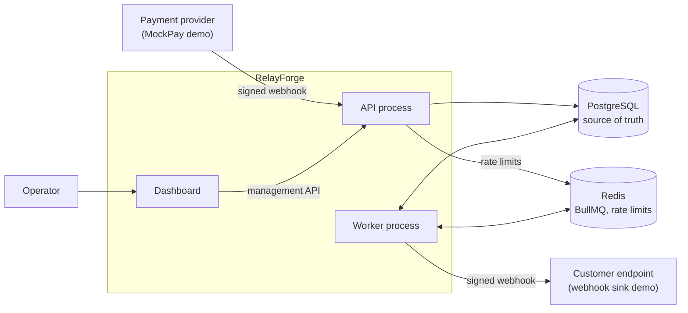
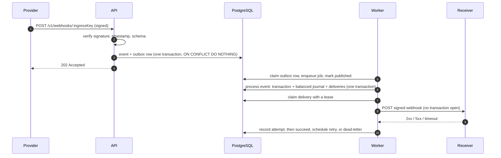

# RelayForge

Webhook ingestion, transaction processing and reliable webhook delivery.

RelayForge receives signed webhooks from payment providers, turns each event into
exactly one change of financial state backed by a balanced double-entry ledger, and
delivers signed webhooks to customer endpoints with retries, dead-lettering and
audited replay.

[Architecture](docs/architecture.md) · [Reliability](docs/reliability.md) ·
[Security](docs/security.md) · [Decisions](docs/decisions/) ·
[Implementation plan](docs/implementation-plan.md)

## Contents

1. [What RelayForge is](#1-what-relayforge-is)
2. [Why it exists](#2-why-it-exists)
3. [Architecture](#3-architecture)
4. [Event lifecycle](#4-event-lifecycle)
5. [Reliability guarantees](#5-reliability-guarantees)
6. [Security model](#6-security-model)
7. [Retry behaviour](#7-retry-behaviour)
8. [Idempotency](#8-idempotency)
9. [Local setup](#9-local-setup)
10. [Demo](#10-demo)
11. [API examples](#11-api-examples)
12. [Testing](#12-testing)
13. [Project structure](#13-project-structure)
14. [Trade-offs](#14-trade-offs)
15. [Future improvements](#15-future-improvements)

## 1. What RelayForge is

A backend platform, built as a portfolio project, that sits between payment
providers and the systems that need to know about payments:

- **Ingests** provider webhooks: verifies Standard Webhooks HMAC signatures over the
  raw body, enforces timestamp tolerance, validates payloads and stores each event
  exactly once.
- **Processes** events asynchronously into domain transactions and a double-entry
  ledger, atomically, with database-enforced invariants.
- **Delivers** signed webhooks to customer endpoints with exponential backoff,
  `Retry-After` support, a dead letter queue and replay.
- **Operates**: API keys with roles and revocation, audit logs, rate limiting,
  reconciliation between transactions and the ledger, metrics and a dashboard.

It is built with TypeScript, NestJS, PostgreSQL (Prisma), BullMQ on Redis and a
Next.js dashboard, and runs locally with Docker Compose.

## 2. Why it exists

Webhooks look simple and fail in subtle ways. Providers retry, so the same event
arrives many times, sometimes concurrently. Events arrive out of order. Processes
crash between writing to the database and enqueueing work. Customer endpoints time
out after they have already processed a request. A naive handler double-charges,
loses events, or silently drops deliveries.

RelayForge exists to show how to handle those failure modes deliberately and
defensibly: correctness enforced by the database rather than by hope, honest
at-least-once delivery semantics, and tests that reproduce the races instead of
assuming them away.

## 3. Architecture



- **One codebase, two processes.** The API process accepts webhooks and serves the
  management API. The worker process publishes the outbox, processes events, delivers
  webhooks and runs recovery. Slow customer endpoints can never starve ingestion.
- **PostgreSQL is the source of truth; Redis is transport.** Work is handed to BullMQ
  through a [transactional outbox](docs/decisions/006-transactional-outbox.md), so
  losing Redis delays work but loses none.
- **Invariants live in the database:** unique constraints for idempotency, deferred
  triggers that refuse unbalanced journals, append-only and final-state triggers,
  composite foreign keys for tenant isolation.

Details: [docs/architecture.md](docs/architecture.md).

## 4. Event lifecycle



Event statuses: `RECEIVED` → `PROCESSED`, `IGNORED` (unknown event type) or `FAILED`
(a business rule violation, a refund whose payment never arrived, or repeated
unexpected errors). Delivery statuses: `PENDING` → `PROCESSING` →
`SUCCEEDED` or `DEAD_LETTER`, with retries returning to `PENDING`.

## 5. Reliability guarantees

| Guarantee                                                 | Enforced by                                                          |
| --------------------------------------------------------- | -------------------------------------------------------------------- |
| A provider event is stored at most once                   | `UNIQUE (provider_connection_id, external_event_id)` + `ON CONFLICT` |
| Accepted work cannot be lost between database and queue   | Transactional outbox; publish marked only after Redis acknowledges   |
| An event changes financial state at most once, atomically | Row and advisory locks, one transaction, unique journal keys         |
| Every journal balances                                    | Deferred constraint triggers checked at `COMMIT`                     |
| One worker attempts a delivery at a time                  | Conditional claim with lease; finalise requires the same lease owner |
| Delivery history is never rewritten                       | Append-only attempts, final-state triggers, replay as a new delivery |
| Stranded work is repaired                                 | Recovery sweep with an advisory lock                                 |

**Delivery is at least once, never exactly once.** If a receiver processes a request
but the worker loses its lease before recording the response, RelayForge cannot know,
and retries. Every attempt and replay of an event carries the same `webhook-id`, so
receivers can deduplicate. This ambiguous case is reproduced by an integration test
and explained in [docs/reliability.md](docs/reliability.md).

## 6. Security model

- **Inbound:** Standard Webhooks HMAC-SHA256 over the raw request body, constant-time
  comparison, per-connection timestamp tolerance. The ingress key in the URL routes
  requests and is not a secret. Requests failing signature, timestamp or
  payload checks are kept as safe security records (hashes and reasons, never bodies).
- **API keys:** `rf_<prefix>_<secret>` with 256 bits of entropy, stored as SHA-256,
  shown once, revocable with immediate effect, `ADMIN` and `MEMBER` roles, workspace
  always derived from the key.
- **Secrets at rest:** provider and endpoint signing secrets encrypted with
  AES-256-GCM, purpose-bound.
- **SSRF protection:** delivery destinations are checked against private, loopback,
  link-local and IPv4-embedding IPv6 ranges on the resolved address at connect time;
  redirects are not followed.
- **Limits and logs:** Redis rate limits (fail-open, documented), body size limits,
  structured logs with request ids and credential redaction, append-only audit log.
- **Dashboard:** no login; holds a workspace key server-side and is published on
  localhost only. Production identity is out of scope.

Threat model and known gaps: [docs/security.md](docs/security.md).

## 7. Retry behaviour

| Outcome                               | Result                                   |
| ------------------------------------- | ---------------------------------------- |
| 2xx                                   | `SUCCEEDED`                              |
| Timeout, network error, 408, 429, 5xx | Retry with backoff                       |
| Other 4xx, 3xx, blocked destination   | `DEAD_LETTER` (`NON_RETRYABLE_RESPONSE`) |
| Endpoint disabled or deleted          | `DEAD_LETTER` (`ENDPOINT_UNAVAILABLE`)   |
| Retryable failure on the last attempt | `DEAD_LETTER` (`MAX_ATTEMPTS_EXHAUSTED`) |

- **Backoff:** exponential with equal jitter, `base × 2^(attempt−1)` capped at a
  maximum, then a random point in its upper half.
- **`Retry-After`** on 429 and 503 can lengthen the delay, never shorten it, and is
  still capped.
- **Configurable:** `DELIVERY_RETRYABLE_STATUS_CODES` (default `408,429,5xx`),
  `DELIVERY_MAX_ATTEMPTS` (8), `DELIVERY_RETRY_BASE_MS` (10 s),
  `DELIVERY_RETRY_MAX_MS` (1 h), `DELIVERY_TIMEOUT_MS` (10 s). `.env.example` uses
  demo-scale values (5 attempts, 2 s base, 30 s cap) so dead-lettering is visible
  within a minute.
- **Every attempt is recorded** with its outcome, status or error, duration and a
  truncated response body. `UNKNOWN` marks an attempt whose worker lost its lease.
- **Replay** (`POST /v1/deliveries/:id/replay`, admin only) creates a new delivery
  for a `SUCCEEDED` or `DEAD_LETTER` one, leaves the original untouched, allows one
  active replay at a time, and writes an audit log entry.

Rationale: [ADR 004](docs/decisions/004-retry-policy.md).

## 8. Idempotency

Providers deliver at least once, so the same event must be safe to receive any
number of times, including concurrently.

1. **At ingestion**, the event row is inserted with `INSERT … ON CONFLICT DO NOTHING`
   against `UNIQUE (provider_connection_id, external_event_id)`. There is no
   check-then-insert race: whichever request commits first wins, the others see a
   conflict and answer `202 {"duplicate": true}`. A different payload under the same
   event id is rejected with `409` and the original kept.
2. **At processing**, the event row is locked and its status checked, so a second
   job for a processed event does nothing. An advisory lock per provider payment
   serialises events for the same payment, and unique keys (one transaction per
   payment, one journal per source event, one refund journal per refund id) make a
   duplicate write fail instead of doubling money.
3. **Rejected requests never take part in idempotency**: a forged request with a
   real event id cannot block the genuine event.

Tested with 25 concurrent identical requests followed by 10 concurrent processing
runs: one event, one transaction, one journal, two postings. See
[ADR 001](docs/decisions/001-idempotency.md).

## 9. Local setup

### With Docker (recommended)

Requirements: Docker with Compose v2.

```bash
git clone <repository-url> relayforge
```

```bash
cd relayforge
```

```bash
cp .env.example .env
```

```bash
docker compose up --build
```

| Service      | URL                                                  |
| ------------ | ---------------------------------------------------- |
| API          | http://localhost:3000 (Swagger UI at `/docs`)        |
| Dashboard    | http://localhost:3001 (bound to 127.0.0.1)           |
| Webhook sink | http://localhost:4000 (`GET /received`, `PUT /mode`) |
| PostgreSQL   | localhost:5432                                       |
| Redis        | localhost:6379                                       |

The `migrate` container applies migrations and seeds a demo workspace, an admin API
key, a MockPay connection and an endpoint pointing at the sink, then exits. Ports
can be changed in `.env` (`API_PORT`, `DASHBOARD_PORT`, `SINK_PORT`,
`POSTGRES_PORT`, `REDIS_PORT`).

> The credentials in `.env.example` (encryption key, API keys, MockPay secret) are
> public development values. Never use them outside local development.

### Without Docker for the apps

Requirements: Node.js 24 LTS (`.nvmrc`) and pnpm via Corepack.

```bash
cp .env.example .env
```

```bash
corepack enable
```

```bash
pnpm install
```

```bash
docker compose up -d postgres redis
```

```bash
pnpm build
```

```bash
pnpm --filter @relayforge/api db:migrate
```

```bash
pnpm --filter @relayforge/api db:seed
```

Then start each process in its own terminal:

| Process      | Command                                        |
| ------------ | ---------------------------------------------- |
| API          | `pnpm --filter @relayforge/api start`          |
| Worker       | `pnpm --filter @relayforge/api start:worker`   |
| Webhook sink | `pnpm --filter @relayforge/webhook-sink start` |
| Dashboard    | `pnpm --filter @relayforge/dashboard dev`      |

The API and worker read the root `.env`. The dashboard reads `RELAYFORGE_API_URL` and
`DASHBOARD_API_KEY` from its own environment, for example
`apps/dashboard/.env.local`. For deliveries to reach the seeded sink endpoint on
localhost, set `DELIVERY_ALLOW_PRIVATE_DESTINATIONS=true` in `.env`; registering other
plain-http endpoints through the API also needs `ENDPOINT_ALLOW_HTTP=true`
(development only). The dashboard dev server listens on 127.0.0.1:3001.

## 10. Demo

With the stack running (the scripts read `.env`):

```bash
pnpm demo:event
```

Sends one signed MockPay `payment.succeeded` webhook and follows it through
ingestion, processing into the ledger, and delivery to the sink:

```text
→ MockPay sends payment.succeeded evt_593286db4c774809
← 202 {"eventId":"01a0a47e-…","duplicate":false}
✓ Event PROCESSED after 382 ms
  Transaction  SUCCEEDED  4200 USD
  Journal      PAYMENT_CAPTURED
               DEBIT  provider_clearing  4200
               CREDIT merchant_balance   4200
✓ Delivery SUCCEEDED after 1 attempt(s)
```

```bash
pnpm demo:duplicate
```

Sends the same signed event 25 times concurrently and checks through the API that
exactly one event, one transaction, one journal and two postings exist.

```bash
pnpm demo:sink FAIL_500
```

Makes the sink fail. Send another `pnpm demo:event`, then watch the delivery retry
and reach the dead letter queue in the dashboard (about 30 seconds with the demo
settings). Switch back with `pnpm demo:sink SUCCESS` and press **Replay**. Other
modes: `TIMEOUT` and `RANDOM_FAILURE 0.5`. `GET http://localhost:4000/received`
shows what the sink received, with repeated `webhook-id` values flagged as
duplicates.

The brief asked for `npm run demo:*`; this is a pnpm workspace, so the scripts run
with `pnpm`.

## 11. API examples

All management endpoints require `Authorization: Bearer <api key>`. The seeded demo
admin key is `SEED_ADMIN_API_KEY` in `.env`. Errors use one envelope:
`{"error":{"code","message","details?","requestId"}}`. Money is returned as strings
of minor units. Lists are cursor-paginated (`?limit=&cursor=`, newest first).

```bash
export KEY="$(grep ^SEED_ADMIN_API_KEY= .env | cut -d= -f2)"
```

```bash
curl -s localhost:3000/health/ready
```

```bash
curl -s -H "Authorization: Bearer $KEY" "localhost:3000/v1/events?status=PROCESSED&limit=5"
```

```bash
curl -s -H "Authorization: Bearer $KEY" "localhost:3000/v1/deliveries?status=DEAD_LETTER"
```

```bash
curl -s -X POST -H "Authorization: Bearer $KEY" localhost:3000/v1/deliveries/<delivery-id>/replay
```

```bash
curl -s -X POST -H "Authorization: Bearer $KEY" -H "Content-Type: application/json" -d '{"url":"https://example.com/webhooks","eventTypes":["payment.succeeded","payment.refunded"]}' localhost:3000/v1/endpoints
```

```bash
curl -s -X POST -H "Authorization: Bearer $KEY" -H "Content-Type: application/json" -d '{"name":"read-only reporting","role":"MEMBER"}' localhost:3000/v1/api-keys
```

```bash
curl -s -X POST -H "Authorization: Bearer $KEY" localhost:3000/v1/admin/reconciliation/run
```

Webhook ingestion is `POST /v1/webhooks/:publicIngressKey` with `webhook-id`,
`webhook-timestamp` and `webhook-signature` headers; `scripts/demo/client.ts` shows
how to sign a request. The brief proposed `/v1/providers/:provider/webhooks`; the
route was changed during design review so that one provider can have many
connections, each with its own secret.

| Method and path                                | Purpose                                   |
| ---------------------------------------------- | ----------------------------------------- |
| `POST /v1/webhooks/:publicIngressKey`          | Ingest a signed provider webhook          |
| `GET /v1/events`, `/v1/events/:id`             | Incoming events                           |
| `GET /v1/rejected-webhook-attempts`            | Rejected webhook security records         |
| `GET /v1/provider-connections`                 | Connections and their ingress paths       |
| `GET /v1/transactions`, `/v1/transactions/:id` | Domain transactions with journals         |
| `GET /v1/ledger`, `/v1/ledger/balances`        | Journals and account balances             |
| `GET /v1/endpoints`, `/v1/endpoints/:id`       | Webhook endpoints                         |
| `POST /v1/endpoints`; `PATCH, DELETE /:id`     | Manage endpoints (admin)                  |
| `GET /v1/deliveries`, `/v1/deliveries/:id`     | Deliveries with attempts                  |
| `POST /v1/deliveries/:id/replay`               | Replay a final delivery (admin)           |
| `POST, GET /v1/api-keys`; `DELETE /:id`        | API keys (admin)                          |
| `POST /v1/admin/reconciliation/run`            | Reconcile transactions and ledger (admin) |
| `GET /v1/metrics/overview`                     | Operational metrics for a time window     |
| `GET /health`, `/health/live`, `/health/ready` | Health checks                             |

The typed contract for ingestion and the management API is in Swagger at
http://localhost:3000/docs.

## 12. Testing

```bash
pnpm test
```

Runs unit tests for every package (pure logic: state machine, retry policy, postings,
reconciliation rules, signatures, SSRF guard, formatting).

```bash
pnpm test:integration
```

Runs API integration tests against real PostgreSQL and Redis. They use
`TEST_DATABASE_URL` (database name must end in `_test`) and `TEST_REDIS_URL` (a
non-zero Redis database); `docker compose up -d postgres redis` provides both. Tests
run serially and truncate tables between cases.

```bash
pnpm format:check && pnpm lint && pnpm typecheck && pnpm build
```

CI (`.github/workflows/ci.yml`) runs all of the above and checks that migrations match
`schema.prisma`.

The required behaviours and where they are tested:

| Behaviour                                   | Test                                                                                                                                                        |
| ------------------------------------------- | ----------------------------------------------------------------------------------------------------------------------------------------------------------- |
| Valid HMAC accepted                         | `webhook-ingestion.int-spec.ts` › stores a validly signed event…; `standard-webhooks.spec.ts`                                                               |
| Invalid HMAC rejected                       | `webhook-ingestion.int-spec.ts` › rejects an invalid signature…                                                                                             |
| Stale timestamp rejected                    | `webhook-ingestion.int-spec.ts` › rejects a stale timestamp even when the signature is authentic                                                            |
| Duplicate event is idempotent               | `webhook-ingestion.int-spec.ts` › treats a byte-identical redelivery as a duplicate…                                                                        |
| 20+ concurrent duplicates → one transaction | `event-processing.int-spec.ts` › creates exactly one transaction, one journal and two postings under concurrent…                                            |
| One ledger entry per transaction            | Same test (one balanced journal of two postings), plus `database-invariants.int-spec.ts` journal tests                                                      |
| Rollback prevents partial state             | `event-processing.int-spec.ts` › leaves no partial state when the transaction fails midway                                                                  |
| 500 retries                                 | `webhook-delivery.int-spec.ts` › retries a 500 response with backoff…                                                                                       |
| 400 does not retry                          | `webhook-delivery.int-spec.ts` › dead-letters a 400 response immediately without retrying                                                                   |
| Timeout retries                             | `webhook-delivery.int-spec.ts` › retries a timeout                                                                                                          |
| Dead-letter state                           | `webhook-delivery.int-spec.ts` › records every attempt and dead-letters once the retry budget is spent                                                      |
| Dead letter can be replayed                 | `webhook-delivery.int-spec.ts` › creates a new delivery referencing the untouched original…                                                                 |
| Every attempt recorded                      | `webhook-delivery.int-spec.ts` › records every attempt…; lists dead-lettered deliveries and shows every attempt                                             |
| Revoked API key rejected                    | `api-keys.int-spec.ts` › revokes a key so it is rejected on the very next request                                                                           |
| Rate limit works                            | `rate-limit.int-spec.ts` › allows the limit, then answers 429 with Retry-After; `webhook-ingestion.int-spec.ts` › rate limits per ingress key and client IP |
| Reconciliation detects mismatch             | `reconciliation.int-spec.ts` › detects a transaction amount that differs from its capture journal, and more                                                 |

Beyond the brief, integration tests also cover lease reclamation with `UNKNOWN`
attempts, stale workers, the outbox under Redis outages, database triggers exercised
with raw SQL, SSRF, tenant isolation and more. Several were mutation-checked by
removing the guarding code and confirming the test fails.

## 13. Project structure

```text
relayforge
├── apps
│   ├── api             NestJS API and worker (src/main.ts, src/worker.ts)
│   │   ├── prisma      schema, migrations (including hand-written invariants), seed
│   │   ├── src         modules: ingestion, processing, ledger, deliveries, …
│   │   └── test        integration tests and support
│   ├── dashboard       Next.js operator dashboard
│   └── webhook-sink    local receiver with switchable failure modes
├── packages
│   └── shared          Standard Webhooks signing, MockPay schemas
├── scripts/demo        demo:event, demo:duplicate, demo:sink
├── docs                architecture, reliability, security, ADRs, plan
├── docker              Postgres init (creates the test database)
└── docker-compose.yml  the full local stack
```

## 14. Trade-offs

- **Modular monolith over microservices.** Two process types from one codebase give
  isolation where it matters (ingestion versus slow deliveries) without distributed
  transactions or duplicated domain code.
- **PostgreSQL as the source of truth, Redis as transport.** The outbox adds a table
  and up to one poll interval (500 ms) of latency, in exchange for never losing work
  between a commit and an enqueue.
- **At-least-once delivery.** Exactly-once over HTTP is not achievable; RelayForge
  retries on ambiguity and gives receivers a stable `webhook-id` instead of claiming
  otherwise.
- **Database-enforced invariants.** Triggers and constraints make migrations more
  involved and some behaviour less visible in application code, but they hold even
  for bugs, scripts and manual SQL.
- **Fixed-window rate limiting that fails open.** Simple and cheap; allows bursts at
  window edges and no limiting during a Redis outage, so ingestion does not depend on
  Redis.
- **Fast hashes for API keys.** Keys have 256 bits of entropy, so SHA-256 is as safe
  as a slow hash and keeps authentication to one indexed lookup.
- **A dashboard without login.** Enough for a local operator console; real identity is
  explicitly out of scope.
- **NestJS 11 and BullMQ 5, not the newest majors,** because the newer majors were
  ESM-only or changed client models recently; see the toolchain table in the plan.

## 15. Future improvements

- Retention and archiving for events, rejected attempts, audit logs and delivery
  history (for example monthly partitions).
- `ENCRYPTION_KEY` versioning and rotation, API key expiry and finer scopes.
- Real identity for the dashboard (OIDC), with per-user audit.
- More providers behind the adapter interface, and signature schemes beyond Standard
  Webhooks.
- Per-endpoint retry policies, delivery rate limits and circuit breaking for failing
  endpoints.
- OpenTelemetry traces and metrics export, once there is a real backend to send them
  to.
- Load testing to establish actual throughput figures before claiming any.
