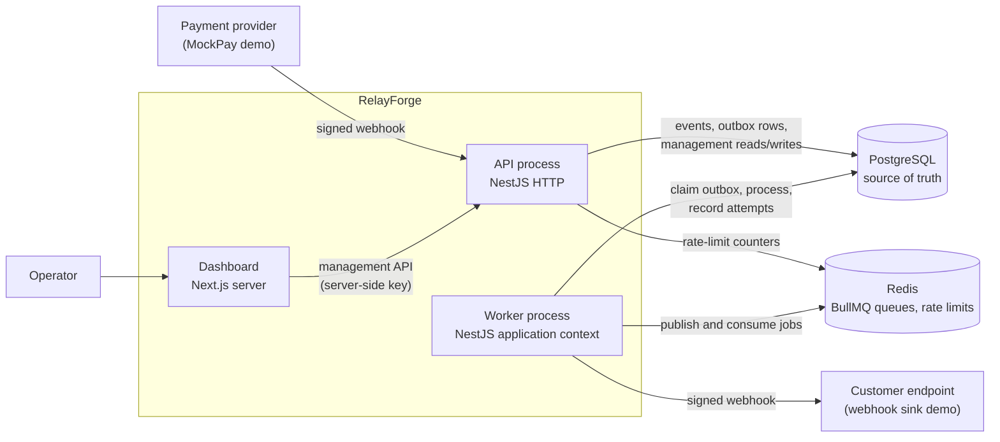
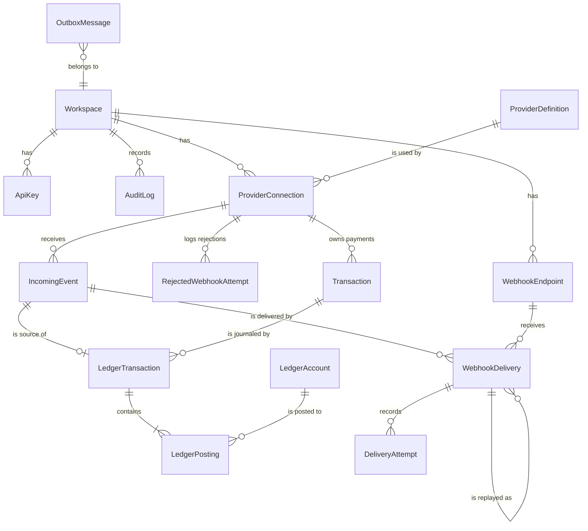
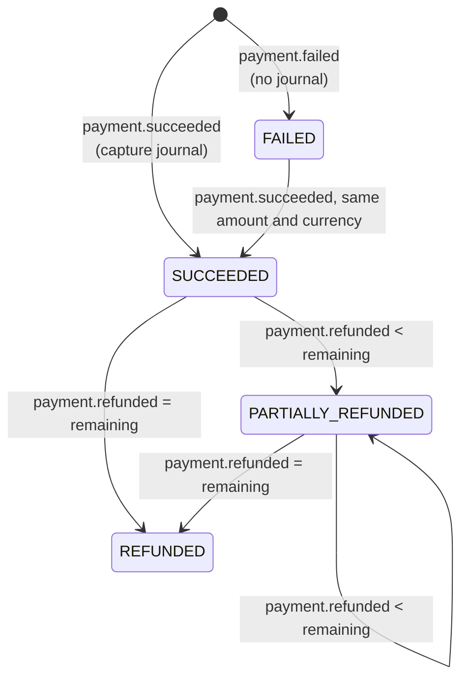
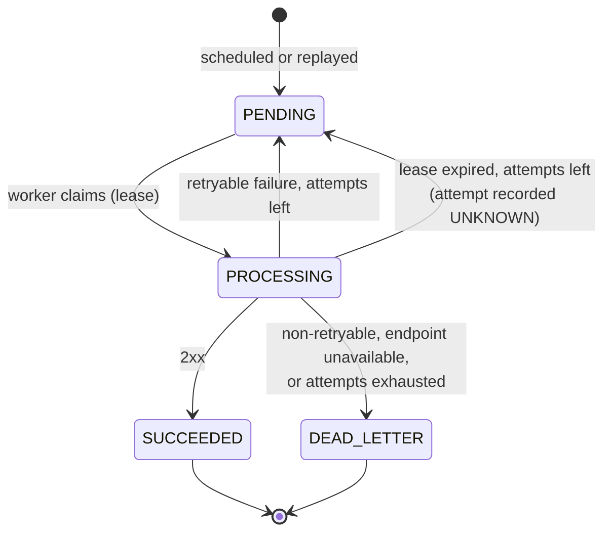

# Architecture

RelayForge is a modular monolith: one NestJS codebase that runs as two process
types sharing one PostgreSQL database and one Redis instance. This document
describes the components, how an event moves through them, the data model, and
where each responsibility lives in the code. Reliability guarantees are in
[reliability.md](reliability.md), security controls in [security.md](security.md),
and the reasoning behind key decisions in the [ADRs](decisions/).

## Components



| Component      | Code                     | Responsibility                                                                                     |
| -------------- | ------------------------ | -------------------------------------------------------------------------------------------------- |
| API process    | `apps/api/src/main.ts`   | Webhook ingestion, management API, health checks, Swagger. Never talks to BullMQ.                  |
| Worker process | `apps/api/src/worker.ts` | Outbox publisher, event processing and delivery consumers, recovery sweep. Serves no HTTP.         |
| Dashboard      | `apps/dashboard`         | Server-rendered operator console over the management API.                                          |
| Webhook sink   | `apps/webhook-sink`      | Local stand-in for a customer endpoint with switchable failure modes.                              |
| Shared package | `packages/shared`        | Standard Webhooks signing and verification, MockPay payload schemas. Used by API, demo, dashboard. |
| PostgreSQL 17  | `apps/api/prisma`        | All durable state and the invariants that protect it (constraints, triggers).                      |
| Redis 7.4      | —                        | BullMQ transport and rate-limit counters. Losing Redis data delays work but loses none.            |

**Why two processes from one codebase.** Deliveries wait on customer endpoints that
can be slow or hostile. Running them in a separate process means a backlog of slow
deliveries cannot consume the HTTP event loop that accepts provider webhooks. Both
processes scale independently, and sharing one codebase keeps domain code, schema
and tests in one place without the operational cost of microservices.

## Event lifecycle

```mermaid
sequenceDiagram
    autonumber
    participant P as Provider
    participant A as API
    participant DB as PostgreSQL
    participant O as Outbox publisher
    participant Q as BullMQ (Redis)
    participant E as Event consumer
    participant D as Delivery consumer
    participant R as Receiver

    P->>A: POST /v1/webhooks/:ingressKey (signed)
    A->>A: verify HMAC on raw body, timestamp, payload schema
    A->>DB: BEGIN; insert event ON CONFLICT DO NOTHING; insert outbox row; COMMIT
    A-->>P: 202 {eventId, duplicate}
    O->>DB: claim due outbox rows (FOR UPDATE SKIP LOCKED, lease)
    O->>Q: add job (job id = outbox id)
    O->>DB: mark published
    Q->>E: event-processing job
    E->>DB: BEGIN; lock event; advisory lock per payment;<br/>transaction + balanced journal + deliveries + outbox rows; COMMIT
    O->>Q: add delivery jobs (same outbox path)
    Q->>D: webhook-delivery job
    D->>DB: claim delivery with lease (conditional UPDATE)
    D->>R: POST signed webhook (outside any transaction)
    R-->>D: response / timeout / error
    D->>DB: BEGIN; record attempt; next state (retry / succeeded / dead letter); COMMIT
```

1. **Ingestion** (`ingestion/webhook-ingestion.service.ts`). The ingress key
   selects a provider connection. The provider adapter's verifier checks the
   signature over the raw bytes and the timestamp, and the adapter parses and
   normalises the payload. The event row and an `EVENT_PROCESSING_REQUESTED` outbox
   row are written in one transaction. A duplicate returns `202` with
   `duplicate: true`. A request that fails signature, timestamp or payload checks is
   stored as a security record and answered with `4xx`; requests for unknown ingress
   keys, oversized bodies and rate-limited requests are refused before that and only
   logged.
2. **Publishing** (`outbox/outbox-publisher.ts`). The publisher polls for due,
   unpublished rows, leases a batch, enqueues each job with the outbox id as the
   BullMQ job id, and marks a row published only after Redis acknowledges. Failed
   publishes back off. See [ADR 006](decisions/006-transactional-outbox.md).
3. **Processing** (`processing/event-processor.ts`). One database transaction per
   event. Unknown event types become `IGNORED`. Payment events go through a pure state
   machine; the result creates or updates the domain transaction, writes a balanced
   journal, creates one delivery per subscribed active endpoint, and queues those
   deliveries through the outbox. See [ADR 002](decisions/002-event-processing.md).
4. **Delivery** (`deliveries/delivery-attempt.runner.ts`). A worker claims a due
   delivery with a lease, sends the signed request with no transaction open, then
   records the attempt and the next state only if it still holds the lease. Retries
   are new future-dated outbox rows. See [ADR 004](decisions/004-retry-policy.md).
5. **Recovery** (`maintenance/recovery-sweeper.ts`). Periodically reclaims expired
   leases, re-requests work that has been waiting too long without a pending outbox
   message, and prunes old published outbox rows.

## Queues and jobs

| Queue              | Fed by outbox topic          | Consumer                  | Job data                           |
| ------------------ | ---------------------------- | ------------------------- | ---------------------------------- |
| `event-processing` | `EVENT_PROCESSING_REQUESTED` | `EventProcessingConsumer` | `{ outboxMessageId, aggregateId }` |
| `webhook-delivery` | `WEBHOOK_DELIVERY_REQUESTED` | `DeliveryConsumer`        | `{ outboxMessageId, aggregateId }` |

Jobs carry identifiers only. Consumers load current state from PostgreSQL and decide
what to do, so a duplicated, stale or late job is harmless. BullMQ's own retries
(three attempts) cover infrastructure failures inside a job; business retries
(delivery backoff, refunds waiting for their payment) are scheduled in PostgreSQL.

## Data model



| Area      | Tables                                                         | Notes                                                                                                                                                                                                  |
| --------- | -------------------------------------------------------------- | ------------------------------------------------------------------------------------------------------------------------------------------------------------------------------------------------------ |
| Tenancy   | `workspaces`, `api_keys`, `audit_logs`                         | Workspace-scoped tables carry `workspace_id`, and composite `(id, workspace_id)` foreign keys between them stop a row referencing another workspace's row. Attempts are scoped through their delivery. |
| Providers | `provider_definitions`, `provider_connections`                 | A definition is a provider type (MockPay); a connection is one workspace's account with its own ingress key and encrypted secret.                                                                      |
| Ingestion | `incoming_events`, `rejected_webhook_attempts`                 | Events are immutable apart from processing status; `UNIQUE (provider_connection_id, external_event_id)`.                                                                                               |
| Payments  | `transactions`                                                 | One row per provider payment; amounts are `BIGINT` minor units.                                                                                                                                        |
| Ledger    | `ledger_accounts`, `ledger_transactions`, `ledger_postings`    | Double entry; journals must balance at commit; append-only. See [ADR 003](decisions/003-ledger.md).                                                                                                    |
| Delivery  | `webhook_endpoints`, `webhook_deliveries`, `delivery_attempts` | Leases on deliveries; attempts append-only; replays reference the original.                                                                                                                            |
| Handoff   | `outbox_messages`                                              | Durable queue requests, published with leases, pruned after retention.                                                                                                                                 |

Rows created by the application use UUIDv7 ids, which sort by creation time and serve
as stable pagination cursors.

### Payment state machine



Each refund writes a reversing journal. A repeated `payment.failed` for a failed
payment changes nothing. Other transitions not shown (for example a refund
larger than what remains, a repeated refund id, or `payment.failed` after success)
fail the event with a reason and change no financial state. A refund for a payment
that has not arrived yet is retried later.

The ledger uses two accounts per workspace and currency:

| Event   | Debit                       | Credit                         |
| ------- | --------------------------- | ------------------------------ |
| Capture | `provider_clearing` (asset) | `merchant_balance` (liability) |
| Refund  | `merchant_balance`          | `provider_clearing`            |

### Delivery state machine



`SUCCEEDED` and `DEAD_LETTER` are final: a database trigger rejects any further change.
Replay creates a new delivery in `PENDING` that references the original.

## Provider model

A provider is added by implementing a `ProviderAdapter` (`providers/provider-adapter.ts`):

- `verifier`: a `WebhookSignatureVerifier`; only `StandardWebhooksVerifier` exists.
- `parsePayload`: validates the provider's JSON and extracts the external event id and
  type, checking that the signed message id matches.
- `normalizeEvent`: maps a known event to a provider-neutral `PaymentEvent`, or
  reports it as unknown (stored as `IGNORED`).

The adapter registry maps a `ProviderDefinition.adapterType` to its adapter. Only
MockPay is implemented; the brief deliberately limits provider count.

## Code layout

```text
apps/api/src
├── main.ts, app.module.ts          HTTP process
├── worker.ts, worker.module.ts     worker process
├── core/, config/, database/,      platform: config validation, Prisma, Redis,
│   redis/, logging/, errors/,      logging with request ids, error envelope,
│   http/, health/, clock/, crypto/ health checks, clock and secret cipher
├── auth/, api-keys/, rate-limit/,  access control and audit
│   audit/
├── providers/, ingestion/, events/ provider adapters, webhook intake, event queries
├── outbox/, queue/, worker/        outbox writer and publisher, BullMQ wiring, polling loop
├── processing/, transactions/,     state machine, event processor, domain queries,
│   ledger/                         journal writer and ledger queries
├── endpoints/, deliveries/         endpoint management, retry policy, SSRF guard,
│                                   HTTP client, attempt runner, replay
├── maintenance/                    recovery sweep
├── common/                         backoff with jitter, timeouts
└── reconciliation/, metrics/       ledger checks and operational aggregates
```

Modules depend inward on `core`; domain logic that can be pure (state machine,
retry classification, postings, discrepancy detection) has no I/O and is unit
tested exhaustively. Everything that depends on PostgreSQL or Redis behaviour is
covered by integration tests against real services.

## Runtime configuration

All configuration comes from environment variables validated at startup with zod
(`config/app-config.ts`); an invalid value stops the process with a precise message.
`.env.example` lists the variables a developer is likely to change; every other
setting has a documented default in `app-config.ts`. Time and randomness are injected
(`Clock`, `RandomSource`) so leases, backoff and jitter are deterministic in tests.

## Local deployment

`docker compose up --build` starts PostgreSQL, Redis, a one-shot `migrate` container
(migrations and demo seed), the API, the worker, the dashboard and the webhook sink.
The API and worker are built from the same Dockerfile target and differ only in
their command. The API waits for
migrations to finish; the dashboard waits for the API to be healthy.

Out of scope by design: Kubernetes, multiple regions, Kafka, service meshes and
horizontal scaling benchmarks. Nothing in this repository claims measured throughput.
