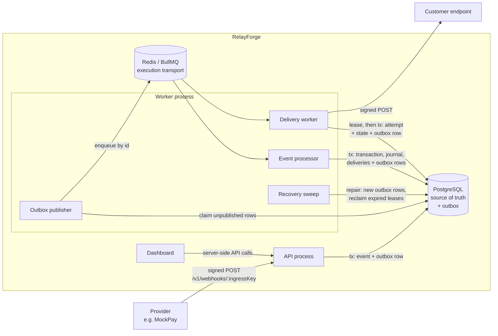
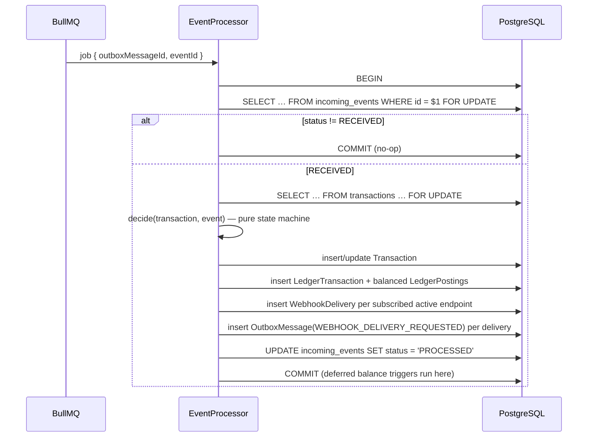
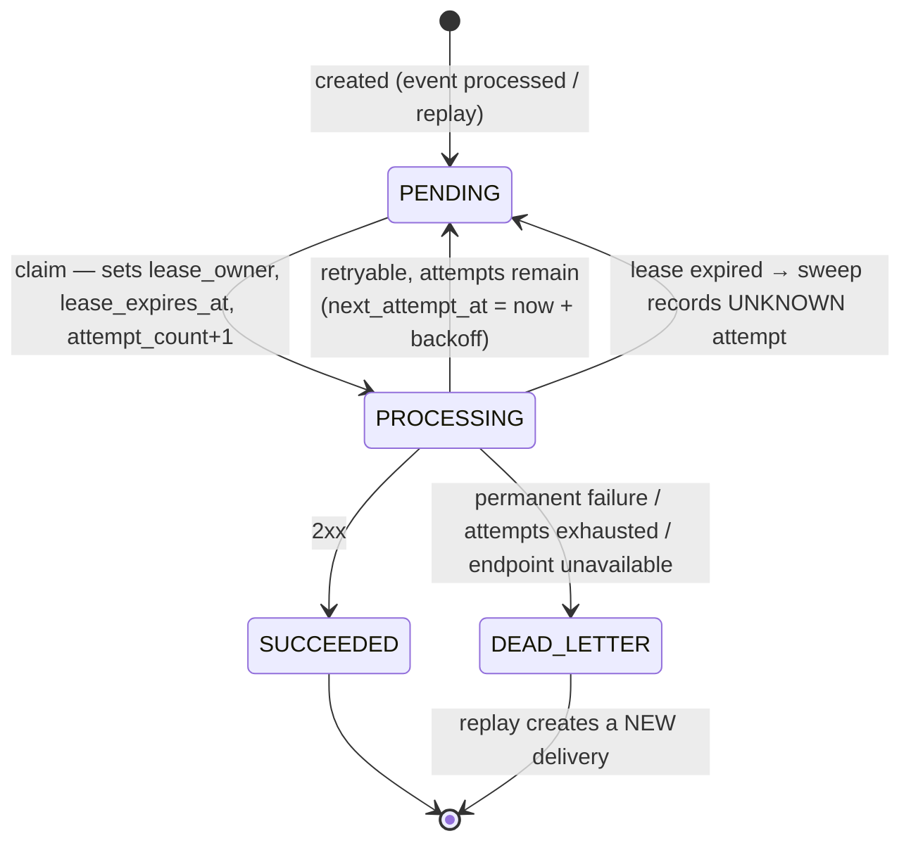

# RelayForge — Architecture & Implementation Plan

Status: **approved, revision 2** — the working plan the implementation follows.
As each decision is built, its rationale moves into `docs/architecture.md`,
`docs/reliability.md`, `docs/security.md`, or an ADR under `docs/decisions/`.

Revision 2 introduces: a transactional outbox, provider definition/connection
split with per-connection ingress keys, persisted rejected webhook attempts, a
minimal double-entry ledger, explicit delivery leases, a pluggable signature
verifier boundary, centralised retry classification, precise attempt-history
semantics, and pinned LTS toolchain versions.

---

## 1. System overview

| Unit              | Tech               | Responsibility                                                                                         |
| ----------------- | ------------------ | ------------------------------------------------------------------------------------------------------ |
| `api` (http)      | NestJS             | Webhook ingestion, management API, health, Swagger                                                     |
| `api` (worker)    | NestJS app context | Outbox publisher, event processing, webhook delivery, recovery sweep. Same image, different entrypoint |
| `dashboard`       | Next.js            | Read-mostly operational UI; talks to the API server-side only                                          |
| `webhook-sink`    | Node `http`        | Simulated customer endpoint with switchable failure modes                                              |
| `packages/shared` | TypeScript         | Standard Webhooks signing primitives, MockPay payload schemas, API response types                      |

The HTTP and worker processes are one NestJS codebase with two entrypoints
(`main.ts`, `worker.ts`). They scale independently, and a slow customer endpoint
can never exhaust ingestion capacity.



### 1.1 Responsibility boundaries

| Layer          | Role                     | Guarantee                                                                           |
| -------------- | ------------------------ | ----------------------------------------------------------------------------------- |
| **PostgreSQL** | Source of truth          | All business state, scheduling (`next_attempt_at`), and history live here           |
| **Outbox**     | Durable handoff boundary | "Work requested" is committed atomically with the state change that requires it     |
| **BullMQ**     | Execution transport      | Low-latency dispatch of IDs to workers. Losing a job delays work; it never loses it |
| **Sweep**      | Defence in depth         | Repairs work stranded _after_ publication (e.g. Redis data loss, crashed lease)     |

Consumers never trust a job: every job handler re-reads and conditionally
transitions database state, so duplicate or stale jobs are harmless no-ops.

---

## 2. Domain invariants

Where the database can enforce an invariant, it does. Application checks exist
to produce clear errors and to fail before touching the database, not as the
only line of defence.

### 2.1 Tenancy & integrations

| #   | Invariant                                                                                                                          | Enforcement                                                                                                    |
| --- | ---------------------------------------------------------------------------------------------------------------------------------- | -------------------------------------------------------------------------------------------------------------- |
| T1  | Every tenant-owned row belongs to exactly one workspace, and child rows cannot reference a parent in a different workspace         | `workspace_id NOT NULL` on tenant tables; composite FKs `(parent_id, workspace_id) → parent(id, workspace_id)` |
| T2  | Management API reads/writes are scoped to the caller's workspace                                                                   | Workspace id comes only from the authenticated API key; lookups filter by it (cross-tenant ids return 404)     |
| T3  | A provider connection belongs to one workspace; many workspaces may connect to the same provider definition with different secrets | `ProviderConnection(workspace_id, provider_definition_id)`; secret stored per connection                       |
| T4  | The ingress key routes a request to a connection but never authenticates it                                                        | `UNIQUE(public_ingress_key)`; authentication is HMAC verification only                                         |

### 2.2 Ingestion

| #   | Invariant                                                                                           | Enforcement                                                                             |
| --- | --------------------------------------------------------------------------------------------------- | --------------------------------------------------------------------------------------- |
| I1  | At most one `IncomingEvent` per `(provider_connection_id, external_event_id)`                       | `UNIQUE` + `INSERT … ON CONFLICT DO NOTHING`                                            |
| I2  | Only signature-verified, schema-valid requests create an `IncomingEvent`                            | Verification and validation before insert; `CHECK (signature_valid)`                    |
| I3  | Rejected requests never participate in business idempotency                                         | Stored in separate `rejected_webhook_attempts` table with no uniqueness on external ids |
| I4  | Stored event identity and payload are immutable; events are never deleted                           | `BEFORE UPDATE` trigger guarding identity/payload columns; `BEFORE DELETE` trigger      |
| I5  | Same external id with a different payload is rejected, never merged                                 | `payload_hash` comparison → `409`, recorded as a rejected attempt                       |
| I6  | Accepting an event and requesting its processing are atomic                                         | `IncomingEvent` + `OutboxMessage` inserted in one transaction                           |
| I7  | Rejected attempts are immutable and contain no secrets or raw payloads                              | Append-only trigger; only hash, reason, request metadata stored                         |
| I8  | Status metadata is consistent (`PROCESSED`/`IGNORED` ⇒ `processed_at`; `FAILED` ⇒ `failure_reason`) | `CHECK` constraints                                                                     |

### 2.3 Financial state (domain + double-entry ledger)

| #   | Invariant                                                                                      | Enforcement                                                                                       |
| --- | ---------------------------------------------------------------------------------------------- | ------------------------------------------------------------------------------------------------- |
| F1  | An event affects financial state at most once                                                  | Row lock on the event + status check in the tx; `UNIQUE(ledger_transactions.source_event_id)`     |
| F2  | At most one domain `Transaction` per provider payment per connection                           | `UNIQUE(provider_connection_id, external_payment_id)`                                             |
| F3  | Domain transaction, ledger journal, event status, deliveries and outbox rows change atomically | One interactive DB transaction per event                                                          |
| F4  | Every ledger transaction is balanced: Σ debits = Σ credits                                     | Pure posting builder asserts before write; **deferred constraint trigger** re-checks at `COMMIT`  |
| F5  | Every ledger transaction has at least two postings                                             | Deferred constraint trigger at `COMMIT`                                                           |
| F6  | A ledger transaction is single-currency and postings match their account's currency            | Composite FKs `(ledger_transaction_id, currency)` and `(account_id, currency)`                    |
| F7  | Ledger transactions and postings are append-only                                               | `BEFORE UPDATE OR DELETE` triggers                                                                |
| F8  | Amounts are positive integer minor units; refunds never exceed the captured amount             | `BIGINT` + `CHECK (amount_minor > 0)`; `CHECK (refunded_amount_minor BETWEEN 0 AND amount_minor)` |
| F9  | The same provider refund is never journaled twice, even under different event ids              | `UNIQUE(transaction_id, kind, external_reference_id)`                                             |
| F10 | Domain transactions agree with the ledger                                                      | Written atomically by the processor; **verified** by reconciliation                               |

### 2.4 Outbox & delivery

| #   | Invariant                                                                                         | Enforcement                                                                                                                            |
| --- | ------------------------------------------------------------------------------------------------- | -------------------------------------------------------------------------------------------------------------------------------------- |
| O1  | An outbox row is published only after BullMQ acknowledged the enqueue                             | `published_at` set in a statement after `addBulk` resolves                                                                             |
| O2  | An outbox row is held by at most one publisher at a time                                          | Claim via `FOR UPDATE SKIP LOCKED` + `lease_owner`/`lease_expires_at`                                                                  |
| O3  | Republishing a row cannot create a second live job for it                                         | BullMQ job id = outbox message id; consumers are idempotent regardless                                                                 |
| D1  | One original delivery per `(event, endpoint)`                                                     | Partial unique index `WHERE replay_of_delivery_id IS NULL`                                                                             |
| D2  | At most one active lease per delivery                                                             | Single `lease_owner`/`lease_expires_at` per row; `CHECK (status = 'PROCESSING') = (lease_owner IS NOT NULL)`; atomic conditional claim |
| D3  | Only the current lease holder can finalise an attempt                                             | Finalising `UPDATE … WHERE lease_owner = $me AND status = 'PROCESSING'`; zero rows ⇒ tx rolled back                                    |
| D4  | Each _claimed_ attempt has at most one immutable attempt record                                   | `UNIQUE(delivery_id, attempt_number)`; append-only trigger                                                                             |
| D5  | Terminal states carry evidence (`SUCCEEDED` ⇒ `delivered_at`; `DEAD_LETTER` ⇒ reason + timestamp) | `CHECK` constraints                                                                                                                    |
| D6  | Delivery history is never deleted; endpoints are soft-deleted                                     | No delete paths; `ON DELETE RESTRICT`                                                                                                  |
| D7  | Replay never mutates the original and at most one replay of a delivery is active                  | Replay inserts a new row; partial unique index on `replay_of_delivery_id WHERE status IN ('PENDING','PROCESSING')`                     |
| D8  | Delivery is **at-least-once**; the `webhook-id` is stable across retries and replays              | Documented contract; id derived from the immutable event                                                                               |

### 2.5 Access & audit

| #   | Invariant                                                               | Enforcement                                                       |
| --- | ----------------------------------------------------------------------- | ----------------------------------------------------------------- |
| A1  | Raw API keys are never stored or logged                                 | SHA-256 hash only (`UNIQUE`); pino redaction                      |
| A2  | Revoked keys are rejected immediately                                   | Guard checks `revoked_at IS NULL` on every request (no key cache) |
| A3  | Signing secrets are encrypted at rest and never returned after creation | AES-256-GCM (`ENCRYPTION_KEY`); response DTOs exclude them        |
| A4  | Security-relevant actions are audited atomically                        | `AuditLog` insert inside the action's tx; append-only trigger     |

---

## 3. Transactional outbox

### 3.1 Why

Writing to PostgreSQL and then enqueueing to Redis is a dual write: a crash or a
Redis outage between the two leaves committed state with no work scheduled. The
outbox removes the dual write from the request path: the state change and the
"work requested" record commit together, and a publisher moves committed rows
into BullMQ with retries.

### 3.2 Topics

| Topic                        | Written by                                                                 | Job handler      |
| ---------------------------- | -------------------------------------------------------------------------- | ---------------- |
| `EVENT_PROCESSING_REQUESTED` | Ingestion (accept); processor (scheduled retry); sweep                     | `EventProcessor` |
| `WEBHOOK_DELIVERY_REQUESTED` | Processor (new delivery); delivery worker (scheduled retry); replay; sweep | `DeliveryWorker` |

**Scheduling lives in PostgreSQL.** A retry is an outbox row with
`available_at = next_attempt_at`. BullMQ never holds long delayed jobs, so a
Redis flush cannot erase a retry schedule.

### 3.3 Publisher algorithm (runs in every worker replica)

```text
loop every OUTBOX_POLL_INTERVAL_MS (default 500 ms):
  1. claim (one short tx):
       UPDATE outbox_messages SET lease_owner = $me,
              lease_expires_at = $now + lease, publish_attempts = publish_attempts + 1
       WHERE id IN (SELECT id FROM outbox_messages
                    WHERE published_at IS NULL AND available_at <= $now
                      AND (lease_expires_at IS NULL OR lease_expires_at < $now)
                    ORDER BY available_at LIMIT $batch
                    FOR UPDATE SKIP LOCKED)
       RETURNING *
  2. queue.addBulk(rows → { name: topic, data: { outboxMessageId, aggregateId },
                            opts: { jobId: outboxMessageId } })
  3a. success → UPDATE … SET published_at = $now, lease_owner = NULL
               WHERE id = ANY($ids) AND lease_owner = $me
  3b. failure → UPDATE … SET lease_owner = NULL, lease_expires_at = NULL,
               available_at = $now + backoff(publish_attempts), last_error = $msg
               WHERE id = ANY($ids) AND lease_owner = $me
```

- The BullMQ connection uses `enableOfflineQueue: false`, so a Redis outage fails
  fast into branch 3b instead of buffering in process memory.
- A publisher crash between 2 and 3a leaves the row leased; once the lease
  expires another publisher republishes it. The job id equals the outbox id, so
  BullMQ ignores the duplicate while the first job still exists; if it has already
  been removed, the consumer's state check makes the second execution a no-op.
- Published rows are pruned after `OUTBOX_RETENTION` (default 7 days). The outbox
  is a handoff mechanism, not history — history lives in domain tables.

### 3.4 Recovery sweep (defence in depth)

Runs every 30 s in the worker, guarded by `pg_try_advisory_xact_lock` so one
replica performs it at a time. It does not need Redis.

| Condition                                                                                  | Repair                                                                                     |
| ------------------------------------------------------------------------------------------ | ------------------------------------------------------------------------------------------ |
| `IncomingEvent` `RECEIVED`, no unpublished outbox row, none published within `STALE_AFTER` | insert `EVENT_PROCESSING_REQUESTED`                                                        |
| `WebhookDelivery` `PENDING` and due for longer than `STALE_AFTER`, same outbox condition   | insert `WEBHOOK_DELIVERY_REQUESTED`                                                        |
| `WebhookDelivery` `PROCESSING` with `lease_expires_at < now`                               | record `UNKNOWN` attempt, move to `PENDING` or `DEAD_LETTER`, insert outbox row (see §5.3) |
| Published outbox rows older than retention                                                 | delete                                                                                     |

These cover work lost _after_ publication (Redis data loss, a job that failed on an
infrastructure error, a crashed delivery worker) — not the commit→enqueue gap,
which the outbox already closes.

---

## 4. Ingestion

### 4.1 Provider model

```text
ProviderDefinition  (global, seeded)        ProviderConnection  (per workspace)
  slug          "mockpay"      1 ───── *      workspace_id
  display_name  "MockPay"                     provider_definition_id
  adapter_type  MOCKPAY                       public_ingress_key   "ing_7Hq2…"  (routing only)
  enabled                                     signing_secret_encrypted
                                              timestamp_tolerance_sec (nullable = disabled)
                                              enabled
```

Route: **`POST /v1/webhooks/:publicIngressKey`**. The key is 24 random base62
characters — unguessable enough to keep drive-by noise out of the pipeline, but
explicitly _not_ a credential: it appears in URLs, provider dashboards and logs.
Authentication is the HMAC.

### 4.2 Adapter and verifier boundary

```ts
interface WebhookSignatureVerifier {
  verify(input: SignatureVerificationInput): SignatureVerificationResult;
}

interface ProviderAdapter {
  readonly type: ProviderAdapterType;
  readonly verifier: WebhookSignatureVerifier;
  parseEvent(body: unknown): ParsedProviderEvent | PayloadValidationFailure;
}
```

`adapter_type` on `ProviderDefinition` selects an adapter from a registry built at
module init. One implementation exists: `MockPayAdapter`, using
`StandardWebhooksVerifier`. A provider with a different scheme (e.g.
`t=…,v1=…`) would add a verifier and an adapter without touching the pipeline.
Unknown adapter types fail at boot, not per request.

### 4.3 Request flow

1. JSON body parser with size limit (`WEBHOOK_MAX_BODY_BYTES`, default 1 MiB), raw body captured.
2. Resolve connection by ingress key → `404` if unknown (logged, **not** persisted — see §4.4).
3. Connection or definition disabled → `404`, rejected attempt recorded.
4. `adapter.verifier.verify(rawBody, headers, secret, now, tolerance)` → `401`, rejected attempt recorded.
   Constant-time comparison; multiple signatures in the header accepted for secret rotation.
5. `adapter.parseEvent(body)` → `422`, rejected attempt recorded.
6. One transaction:
   `INSERT incoming_events … ON CONFLICT (provider_connection_id, external_event_id) DO NOTHING RETURNING id`
   - inserted → insert `OutboxMessage(EVENT_PROCESSING_REQUESTED)` → `COMMIT` → `202`
   - not inserted, same `payload_hash` → `202 { duplicate: true }`
   - not inserted, different hash → `409`, rejected attempt recorded
7. No Redis call in the request path. Ingestion availability depends on PostgreSQL only.

Signature verification happens before schema validation, so unauthenticated callers
learn nothing about the payload schema.

### 4.4 Rejected webhook attempts

`RejectedWebhookAttempt` is an append-only security record:
`provider_connection_id`, `received_at`, `reason`
(`CONNECTION_DISABLED | MISSING_SIGNATURE_HEADERS | INVALID_SIGNATURE |
TIMESTAMP_OUTSIDE_TOLERANCE | INVALID_PAYLOAD | PAYLOAD_CONFLICT`),
`payload_hash`, `body_bytes`, `request_id`, `source_ip`, and sanitised `metadata`
(truncated `webhook-id`/`webhook-timestamp` values, user agent, validation issue paths
— never signature values, secrets, or the payload itself).

- Only attempts that resolve to a real connection are persisted. Requests with an
  unknown ingress key are unattributable; persisting them would give anyone on the
  internet a free write path into the database. They are logged and rate limited.
- Recording a rejection is best-effort relative to the response: if the insert fails,
  the request is still rejected and the failure is logged at `error`.
- Retention/pruning is documented as a future concern.

---

## 5. Processing and delivery

### 5.1 Event processing



- No network I/O inside the transaction. A crash rolls everything back; the event
  stays `RECEIVED` and is picked up again.
- **State machine** (pure, exhaustively unit-tested):

| Event               | No transaction                                                  | SUCCEEDED / PARTIALLY_REFUNDED                                                                       | FAILED                | REFUNDED |
| ------------------- | --------------------------------------------------------------- | ---------------------------------------------------------------------------------------------------- | --------------------- | -------- |
| `payment.succeeded` | create SUCCEEDED + `PAYMENT_CAPTURED` journal                   | reject `INVALID_TRANSITION`                                                                          | → SUCCEEDED + journal | reject   |
| `payment.failed`    | create FAILED, no journal                                       | reject                                                                                               | no-op                 | reject   |
| `payment.refunded`  | **retry later** `TRANSACTION_NOT_FOUND` (out-of-order delivery) | `PAYMENT_REFUNDED` journal, update refunded amount/status; reject if over-refund or currency differs | reject                | reject   |
| unknown type        | event → `IGNORED`, no deliveries                                | —                                                                                                    | —                     | —        |

- **Retry later**: in the same tx, increment `processing_attempts` and insert an
  outbox row with `available_at = now + backoff`. After `EVENT_MAX_PROCESSING_ATTEMPTS`
  the event becomes `FAILED`. Business rejections mark the event `FAILED`
  immediately and never touch financial state.
- Unexpected errors (e.g. database failures) roll back and rethrow; BullMQ retries
  the job a small number of times, and the sweep is the backstop.

### 5.2 Minimal double-entry ledger

```text
LedgerAccount      (workspace_id, code, currency) unique; type ASSET | LIABILITY
LedgerTransaction  journal header: workspace_id, transaction_id, source_event_id (unique),
                   kind PAYMENT_CAPTURED | PAYMENT_REFUNDED, external_reference_id, currency
LedgerPosting      ledger_transaction_id, account_id, direction DEBIT | CREDIT,
                   amount_minor > 0, currency
```

Two accounts per workspace and currency, created on first use with
`INSERT … ON CONFLICT DO NOTHING`:

| Code                | Type      | Meaning                                     |
| ------------------- | --------- | ------------------------------------------- |
| `provider_clearing` | ASSET     | Funds collected by the provider, owed to us |
| `merchant_balance`  | LIABILITY | Funds owed to the merchant                  |

| Journal kind       | DEBIT               | CREDIT              |
| ------------------ | ------------------- | ------------------- |
| `PAYMENT_CAPTURED` | `provider_clearing` | `merchant_balance`  |
| `PAYMENT_REFUNDED` | `merchant_balance`  | `provider_clearing` |

**Balance enforcement.** A pure `buildPostings()` returns postings and asserts
balance before any write. PostgreSQL then re-checks with `CONSTRAINT TRIGGER …
DEFERRABLE INITIALLY DEFERRED` on `ledger_postings` and `ledger_transactions`,
which run at `COMMIT` and raise if a journal has fewer than two postings or
Σ debits ≠ Σ credits. This is full database-level enforcement at modest cost
(one indexed aggregate per posting at commit). Currency consistency is structural
(composite FKs), not procedural. The model deliberately stops there: no chart of
accounts, fees, FX or settlement.

### 5.3 Delivery, leases and attempts



1. **Claim** (single statement, autocommit):
   `UPDATE webhook_deliveries SET status='PROCESSING', lease_owner=$me, lease_expires_at=$now+LEASE, attempt_count=attempt_count+1 WHERE id=$id AND status='PENDING' AND next_attempt_at <= $now RETURNING *`.
   Zero rows ⇒ someone else holds it or it is not due ⇒ ack the job, do nothing.
2. **Send** outside any transaction: sign, POST with hard timeout, no redirects,
   SSRF-checked destination. `LEASE = request timeout + safety margin` (default 10 s + 50 s).
3. **Finalise** (one tx): `UPDATE … WHERE id=$id AND status='PROCESSING' AND lease_owner=$me`,
   insert `DeliveryAttempt(attempt_number = attempt_count)`, insert the retry outbox
   row if rescheduled. If the guarded update matches zero rows the lease was lost:
   roll back, log at `warn` with the observed outcome.
4. **Lease expiry** (sweep): for `PROCESSING` rows past `lease_expires_at`, insert an
   attempt with outcome `UNKNOWN` (`error_code = LEASE_EXPIRED`), then move to `PENDING`
   (with outbox row) or `DEAD_LETTER` if attempts are exhausted.

**What attempt history guarantees.** Each claimed attempt number has at most one
immutable record: the worker's observed outcome, or `UNKNOWN` when the worker lost
its lease before persisting. It does **not** guarantee that every physical HTTP
request is recorded, and an `UNKNOWN` attempt may or may not have reached the
receiver.

**The unavoidable ambiguous case.** The receiver processes the webhook and returns
`200`; the worker crashes before committing step 3. RelayForge cannot know the
request succeeded, the lease expires, and the delivery is sent again. Delivery is
therefore **at-least-once**. Every request carries the same `webhook-id`
(derived from the incoming event) across retries and replays, and receivers must
deduplicate on it. RelayForge never claims exactly-once delivery.

### 5.4 Retry policy

A single `DeliveryRetryPolicy` (pure, injected, unit-tested) owns classification
and scheduling; the worker only asks it for a decision.

| Observed result                                              | Default class               |
| ------------------------------------------------------------ | --------------------------- |
| 2xx                                                          | `SUCCESS`                   |
| Timeout, DNS failure, connection refused/reset               | `RETRYABLE`                 |
| 408, 429, any 5xx                                            | `RETRYABLE`                 |
| 3xx (redirects not followed), other 4xx, blocked destination | `PERMANENT` → `DEAD_LETTER` |

- Retryable status codes are configurable (`DELIVERY_RETRYABLE_STATUS_CODES`);
  defaults as above.
- Backoff: `cap = min(maxDelay, base · 2^(attempt−1))`, `delay = cap/2 + random(0, cap/2)`
  (equal jitter: decorrelates retries while guaranteeing growth).
- `Retry-After` on 429/503 is honoured when it parses as delta-seconds or a future
  HTTP date: `delay = min(maxDelay, max(retryAfter, computedBackoff))`. It can
  lengthen a delay, never shorten it; invalid values are ignored.
- `max_attempts` is snapshotted on the delivery at creation.
- Clock and random source are injected for deterministic tests.

### 5.5 Replay

`POST /v1/deliveries/:id/replay` — allowed from `SUCCEEDED` or `DEAD_LETTER`;
requires an active, non-deleted endpoint. One tx: insert a new `PENDING` delivery
(`replay_of_delivery_id`), its outbox row, and an `AuditLog` row. The original
delivery and its attempts are untouched. Concurrent replays of the same delivery
are serialised by the partial unique index (second request → `409`).

---

## 6. Database schema

Conventions:

- IDs are UUIDv7 (time-ordered ⇒ cursor pagination on `id`).
- Timestamps are `timestamptz(3)`.
- Money is `BIGINT` minor units + ISO-4217 `CHAR(3)`; serialised as strings in JSON.
- Foreign keys are `ON DELETE RESTRICT`. No cascades over financial, delivery or audit data.
- Composite `(id, workspace_id)` unique keys on parents make tenant ownership a foreign-key fact.
- Prisma cannot express CHECK constraints, partial indexes, or triggers; these are
  added by hand to the generated migration and covered by integration tests.

```prisma
enum ProviderAdapterType   { MOCKPAY }
enum ApiKeyRole            { ADMIN MEMBER }
enum IncomingEventStatus   { RECEIVED PROCESSED IGNORED FAILED }
enum RejectionReason       { CONNECTION_DISABLED MISSING_SIGNATURE_HEADERS INVALID_SIGNATURE
                             TIMESTAMP_OUTSIDE_TOLERANCE INVALID_PAYLOAD PAYLOAD_CONFLICT }
enum TransactionStatus     { SUCCEEDED FAILED PARTIALLY_REFUNDED REFUNDED }
enum LedgerAccountType     { ASSET LIABILITY }
enum LedgerTransactionKind { PAYMENT_CAPTURED PAYMENT_REFUNDED }
enum PostingDirection      { DEBIT CREDIT }
enum DeliveryStatus        { PENDING PROCESSING SUCCEEDED DEAD_LETTER }
enum DeadLetterReason      { MAX_ATTEMPTS_EXHAUSTED NON_RETRYABLE_RESPONSE ENDPOINT_UNAVAILABLE }
enum AttemptOutcome        { SUCCESS RETRYABLE_FAILURE PERMANENT_FAILURE UNKNOWN }
enum OutboxTopic           { EVENT_PROCESSING_REQUESTED WEBHOOK_DELIVERY_REQUESTED }
enum AuditActorType        { API_KEY SYSTEM }

model Workspace {
  id        String   @id @default(uuid(7)) @db.Uuid
  name      String
  createdAt DateTime @default(now())
}

model ApiKey {
  id          String     @id @default(uuid(7)) @db.Uuid
  workspaceId String     @db.Uuid
  name        String
  role        ApiKeyRole
  prefix      String     @unique               // "rf_3kq9x2ab" — safe to display
  keyHash     String     @unique @db.Char(64)  // sha256(full key), hex
  lastUsedAt  DateTime?
  revokedAt   DateTime?
  createdAt   DateTime   @default(now())
}

model ProviderDefinition {
  id          String              @id @default(uuid(7)) @db.Uuid
  slug        String              @unique
  displayName String
  adapterType ProviderAdapterType
  enabled     Boolean             @default(true)
  createdAt   DateTime            @default(now())
}

model ProviderConnection {
  id                     String   @id @default(uuid(7)) @db.Uuid
  workspaceId            String   @db.Uuid
  providerDefinitionId   String   @db.Uuid
  name                   String
  publicIngressKey       String   @unique
  signingSecretEncrypted String
  timestampToleranceSec  Int?     // null disables the tolerance check
  enabled                Boolean  @default(true)
  createdAt              DateTime @default(now())
  @@unique([id, workspaceId])
}

model IncomingEvent {
  id                   String              @id @default(uuid(7)) @db.Uuid
  workspaceId          String              @db.Uuid
  providerConnectionId String              @db.Uuid   // FK (id, workspace_id)
  externalEventId      String
  eventType            String
  payload              Json
  payloadHash          String              @db.Char(64)
  signatureValid       Boolean                        // CHECK (signature_valid)
  status               IncomingEventStatus @default(RECEIVED)
  processingAttempts   Int                 @default(0)
  failureReason        String?
  receivedAt           DateTime            @default(now())
  processedAt          DateTime?
  @@unique([providerConnectionId, externalEventId])
  @@unique([id, workspaceId])
  @@index([workspaceId, id(sort: Desc)])
}

model RejectedWebhookAttempt {
  id                   String          @id @default(uuid(7)) @db.Uuid
  workspaceId          String          @db.Uuid
  providerConnectionId String          @db.Uuid   // FK (id, workspace_id)
  reason               RejectionReason
  payloadHash          String          @db.Char(64)
  bodyBytes            Int
  requestId            String
  sourceIp             String?
  metadata             Json
  receivedAt           DateTime        @default(now())
  @@index([workspaceId, id(sort: Desc)])
}

model Transaction {
  id                   String            @id @default(uuid(7)) @db.Uuid
  workspaceId          String            @db.Uuid
  providerConnectionId String            @db.Uuid
  externalPaymentId    String
  status               TransactionStatus
  currency             String            @db.Char(3)
  amountMinor          BigInt
  refundedAmountMinor  BigInt            @default(0)
  createdByEventId     String            @unique @db.Uuid
  createdAt            DateTime          @default(now())
  updatedAt            DateTime          @updatedAt
  @@unique([providerConnectionId, externalPaymentId])
  @@unique([id, workspaceId])
}

model LedgerAccount {
  id          String            @id @default(uuid(7)) @db.Uuid
  workspaceId String            @db.Uuid
  code        String
  type        LedgerAccountType
  currency    String            @db.Char(3)
  createdAt   DateTime          @default(now())
  @@unique([workspaceId, code, currency])
  @@unique([id, workspaceId, currency])
}

model LedgerTransaction {
  id                  String                @id @default(uuid(7)) @db.Uuid
  workspaceId         String                @db.Uuid
  transactionId       String                @db.Uuid   // FK (id, workspace_id)
  sourceEventId       String                @unique @db.Uuid
  kind                LedgerTransactionKind
  externalReferenceId String                // payment id or refund id
  currency            String                @db.Char(3)
  createdAt           DateTime              @default(now())
  @@unique([transactionId, kind, externalReferenceId])
  @@unique([id, workspaceId, currency])
}

model LedgerPosting {
  id                  String           @id @default(uuid(7)) @db.Uuid
  workspaceId         String           @db.Uuid
  ledgerTransactionId String           @db.Uuid   // FK (id, workspace_id, currency)
  accountId           String           @db.Uuid   // FK (id, workspace_id, currency)
  direction           PostingDirection
  amountMinor         BigInt                      // CHECK > 0
  currency            String           @db.Char(3)
  createdAt           DateTime         @default(now())
  @@index([ledgerTransactionId])
  @@index([accountId])
}

model WebhookEndpoint {
  id                     String    @id @default(uuid(7)) @db.Uuid
  workspaceId            String    @db.Uuid
  url                    String
  description            String?
  eventTypes             String[]
  signingSecretEncrypted String
  isActive               Boolean   @default(true)
  createdAt              DateTime  @default(now())
  updatedAt              DateTime  @updatedAt
  deletedAt              DateTime?
  @@unique([id, workspaceId])
}

model WebhookDelivery {
  id                 String            @id @default(uuid(7)) @db.Uuid
  workspaceId        String            @db.Uuid
  eventId            String            @db.Uuid   // FK (id, workspace_id)
  endpointId         String            @db.Uuid   // FK (id, workspace_id)
  replayOfDeliveryId String?           @db.Uuid
  payload            Json
  status             DeliveryStatus    @default(PENDING)
  attemptCount       Int               @default(0)
  maxAttempts        Int
  nextAttemptAt      DateTime?
  leaseOwner         String?
  leaseExpiresAt     DateTime?
  deliveredAt        DateTime?
  deadLetteredAt     DateTime?
  deadLetterReason   DeadLetterReason?
  createdAt          DateTime          @default(now())
  updatedAt          DateTime          @updatedAt
  @@index([workspaceId, status, id(sort: Desc)])
  @@index([status, nextAttemptAt])
  @@index([status, leaseExpiresAt])
}

model DeliveryAttempt {
  id             String         @id @default(uuid(7)) @db.Uuid
  deliveryId     String         @db.Uuid
  attemptNumber  Int
  outcome        AttemptOutcome
  responseStatus Int?
  errorCode      String?        // TIMEOUT | NETWORK_ERROR | BLOCKED_DESTINATION | LEASE_EXPIRED | …
  errorMessage   String?
  responseBody   String?        // first 2 KiB
  durationMs     Int?           // null for UNKNOWN
  startedAt      DateTime?
  recordedAt     DateTime       @default(now())
  @@unique([deliveryId, attemptNumber])
}

model OutboxMessage {
  id              String      @id @default(uuid(7)) @db.Uuid
  workspaceId     String      @db.Uuid
  topic           OutboxTopic
  aggregateId     String      @db.Uuid
  availableAt     DateTime
  publishAttempts Int         @default(0)
  leaseOwner      String?
  leaseExpiresAt  DateTime?
  lastError       String?
  publishedAt     DateTime?
  createdAt       DateTime    @default(now())
  @@index([aggregateId])
  // partial: (available_at) WHERE published_at IS NULL
}

model AuditLog {
  id           String         @id @default(uuid(7)) @db.Uuid
  workspaceId  String         @db.Uuid
  actorType    AuditActorType
  actorId      String?
  action       String         // "api_key.revoked", "delivery.replayed", …
  resourceType String
  resourceId   String
  metadata     Json
  requestId    String?
  createdAt    DateTime       @default(now())
  @@index([workspaceId, id(sort: Desc)])
}
```

Relations are omitted above for readability; they are part of the real schema.

---

## 7. Cross-cutting design

- **Module layout** (`apps/api/src`): `config`, `database`, `logging`, `errors`,
  `crypto`, `auth`, `rate-limit`, `audit`, `providers` (definitions, connections,
  adapters, verifiers), `ingestion`, `events`, `outbox`, `processing`, `ledger`,
  `transactions`, `endpoints`, `deliveries`, `reconciliation`, `metrics`, `health`,
  `maintenance`. Dependencies point inward; no circular imports.
- **Prisma directly in services** — no repository layer. `FOR UPDATE`,
  `SKIP LOCKED`, `ON CONFLICT` and aggregates use typed `$queryRaw`.
- **Validation**: `class-validator` DTOs for the management API (native Nest +
  Swagger). `zod` for provider payload schemas in `packages/shared` (external
  contract shared by the ingestion adapter and the MockPay demo producer) and for
  environment config at boot.
- **Errors**: typed domain errors with stable `code`s; one global filter renders
  `{ error: { code, message, details?, requestId } }`. Unknown errors are logged
  with stack and returned as `500 INTERNAL_ERROR`.
- **Logging**: `nestjs-pino`, JSON. `requestId` from `X-Request-Id` or generated.
  Redacts `authorization`, `webhook-signature`, and any `*secret*` / `*apiKey*`
  path. Worker child loggers carry `correlationId` (= incoming event id),
  `workspaceId`, `providerConnectionId`, `eventId`, `deliveryId`,
  `outboxMessageId`, `attemptNumber`, `durationMs`.
- **Rate limiting**: `@nestjs/throttler` with Redis-backed storage (holds across
  replicas). Per API key for management routes, per ingress key + IP for
  ingestion. Fixed window, documented tradeoff. If Redis is unavailable the
  limiter fails open for ingestion (PostgreSQL remains the only hard dependency
  of accepting events) and this is logged; documented in `security.md`.
- **SSRF protection** on delivery: `https` required unless
  `ALLOW_INSECURE_ENDPOINTS`; resolved addresses checked at connect time
  (defeats DNS rebinding) against private, loopback and link-local ranges unless
  `ALLOW_PRIVATE_ENDPOINTS` (enabled only in local compose for the sink).
- **Pagination**: cursor on UUIDv7 id, `limit` ≤ 100.
- **Dashboard access**: the seeded demo workspace's API key is held server-side by
  the Next.js server and never sent to the browser. There is no login.
  Production identity and authentication are explicitly out of scope and documented.
- **Management API additions** beyond the brief, each needed by an approved
  feature: `GET /v1/provider-connections` (operators need the ingress URL) and
  `GET /v1/metrics/overview` (dashboard; SQL aggregates over real rows).

---

## 8. Implementation phases

Every phase ends with lint, format check, typecheck, unit + integration tests, and
build (where applicable) all green, an architecture review of the diff, and clean
logical commits. A phase with a failing check is not complete.

| Phase                                | Scope                                                                                                                                                                                                               | Exit criteria                                                                                                                                                                |
| ------------------------------------ | ------------------------------------------------------------------------------------------------------------------------------------------------------------------------------------------------------------------- | ---------------------------------------------------------------------------------------------------------------------------------------------------------------------------- |
| **0. Foundation**                    | pnpm workspaces via Corepack, `.nvmrc`, `engines`, strict TS base, ESLint (type-checked) + Prettier, `packages/shared` skeleton, dev compose (Postgres, Redis), `.env.example`, license, CI skeleton                | All quality commands pass on the pinned toolchain                                                                                                                            |
| **1. Data layer & platform**         | Full Prisma schema + migration (CHECKs, partial indexes, composite FKs, append-only and deferred balance triggers), config validation, Prisma module, logging, error filter, health, seed, integration harness      | Tests prove each DB-enforced invariant rejects bad writes (incl. unbalanced journal at COMMIT)                                                                               |
| **2. Access control**                | Secret cipher, API keys (issue/list/revoke), guard, roles, audit log, Redis rate limiting, Swagger                                                                                                                  | Tests: revoked key, rate limit; ADR 005                                                                                                                                      |
| **3. Ingestion + outbox write**      | Standard Webhooks primitives (`shared`), verifier interface, MockPay adapter, connection resolution, raw body + size limit, rejected attempts, idempotent insert + outbox row, events API, provider-connections API | Tests: valid/invalid/stale signature, duplicate, 20 concurrent, rejected attempt does not block genuine event, tenant isolation; ADR 001                                     |
| **4. Outbox publisher & processing** | BullMQ module, worker entrypoint, publisher with leases, state machine, locked processor, double-entry ledger, delivery + outbox creation, endpoints CRUD, transactions/ledger API                                  | Tests: publisher retries on Redis unavailable, deterministic job ids, one transaction + one journal + balanced postings, rollback leaves no partial state; ADR 002, 003, 006 |
| **5. Delivery**                      | Outbound signing, HTTP client + SSRF guard, retry policy, leases, attempts, dead-letter, recovery sweep, deliveries API, replay + audit                                                                             | Tests: 500 retries, 400 no retry, timeout retries, dead-letter, replay, attempts recorded, expired lease reclaimed with `UNKNOWN`, lost lease cannot finalise; ADR 004       |
| **6. Reconciliation & metrics**      | Reconciliation SQL checks + structured report, admin endpoint, metrics endpoint                                                                                                                                     | Test: detects mismatch, missing journal, unexpected reversal, orphan                                                                                                         |
| **7. Local platform**                | webhook-sink, `demo:event`, `demo:duplicate`, Dockerfiles, full compose with migrate + seed                                                                                                                         | Clean clone → `docker compose up --build` → demos show processing, retries, dead-letter                                                                                      |
| **8. Dashboard**                     | Overview, Events, Deliveries (+ replay), Dead Letter, Endpoints, Transactions/Ledger                                                                                                                                | Builds; lint/typecheck clean; verified against the running stack                                                                                                             |
| **9. Hardening & docs**              | Full CI, README, `architecture.md`, `reliability.md`, `security.md`, final review                                                                                                                                   | Every gate green in CI                                                                                                                                                       |

ADRs: `001-idempotency`, `002-event-processing`, `003-ledger`, `004-retry-policy`,
`005-api-key-storage`, `006-transactional-outbox`.

---

## 9. Test strategy

**Unit** (no I/O): Standard Webhooks sign/verify and tolerance, verifier result
mapping, MockPay schema parsing, transaction state machine, posting builder
balance, retry classification (incl. configured codes), backoff/jitter bounds,
`Retry-After` parsing, API key generation/hashing, secret cipher, outbox backoff.

**Integration** (real PostgreSQL + Redis, `runInBand`): the real `AppModule` via
Supertest; worker services invoked directly with an injected clock and random
source; delivery tests against an in-test HTTP server. No mocks of Prisma,
PostgreSQL, Redis, or the HTTP client. Tables truncated between tests.

| #   | Test                                      | Technique                                                                                                                                                          |
| --- | ----------------------------------------- | ------------------------------------------------------------------------------------------------------------------------------------------------------------------ |
| 1   | Valid HMAC accepted                       | Signed request → 202, event + outbox row                                                                                                                           |
| 2   | Invalid HMAC rejected                     | 401, no event, one `RejectedWebhookAttempt`                                                                                                                        |
| 3   | Stale timestamp rejected                  | Injected clock beyond tolerance → 401                                                                                                                              |
| 4   | Duplicate stays idempotent                | Same request twice → 202 ×2, one event, one outbox row                                                                                                             |
| 5   | 20+ concurrent duplicates                 | `Promise.all` ingest, then concurrent processor runs → exactly one event, one `Transaction`, one `LedgerTransaction`, exactly two balanced postings                |
| 6   | Payment creates the expected journal      | One `LedgerTransaction`; DEBIT `provider_clearing` / CREDIT `merchant_balance` for the amount                                                                      |
| 7   | Rollback prevents partial state           | Temporary trigger raising on `webhook_deliveries` insert → no transaction, journal, postings, deliveries or outbox rows; event still `RECEIVED`                    |
| 8   | 500 response retries                      | Attempt `RETRYABLE_FAILURE`, delivery `PENDING`, future outbox row                                                                                                 |
| 9   | 400 response does not retry               | `PERMANENT_FAILURE`, `DEAD_LETTER` immediately                                                                                                                     |
| 10  | Timeout retries                           | Server that never responds + short timeout                                                                                                                         |
| 11  | Dead-letter after max attempts            | Clock advanced across the schedule                                                                                                                                 |
| 12  | Dead-letter replay                        | New delivery referencing original; original untouched; audit row                                                                                                   |
| 13  | Every claimed attempt recorded            | Attempt numbers 1..n contiguous and immutable                                                                                                                      |
| 14  | Revoked API key rejected                  | 401 after revoke                                                                                                                                                   |
| 15  | Rate limit                                | 429 with `Retry-After` past the limit                                                                                                                              |
| 16  | Reconciliation detects mismatch           | Corrupt domain amount via SQL → reported                                                                                                                           |
| 17  | Unbalanced journal impossible             | Raw SQL unbalanced / single-posting journal fails at `COMMIT`; posting `UPDATE`/`DELETE` rejected                                                                  |
| 18  | Outbox survives Redis outage              | Publisher against unreachable Redis → rows stay unpublished with backoff; against real Redis → published, job id = outbox id; republish does not duplicate the job |
| 19  | Expired lease reclaimed                   | Claim, abandon, advance clock → sweep writes `UNKNOWN` attempt, delivery claimable again                                                                           |
| 20  | Lost lease cannot finalise                | Stale worker finalise after reclaim → no state change                                                                                                              |
| 21  | Rejected attempt cannot squat an event id | Forged request with id X, then genuine X → 202 and processed                                                                                                       |
| 22  | Tenant isolation                          | Two workspaces, same provider, same external id → two events; workspace A's key gets 404 for B's resources                                                         |

---

## 10. Toolchain versions

Rules:

- **Stable releases only** — no release candidates, betas, or experimental compilers.
- **LTS Node** — pinned in `.nvmrc`, `engines`, Docker base images and CI.
- **Mutual compatibility over recency** — TypeScript is pinned to the newest
  version that `typescript-eslint`, `ts-jest`, the Nest CLI, Prisma and Next.js all
  support. The TypeScript 7 native compiler is excluded.
- **Package manager pinned via Corepack** (`packageManager` field).
- Exact versions and the reasons for any held-back package are recorded below.
  Packages introduced in later phases are pinned to the listed line at that time.

Registry state checked on 2026-09-14.

| Component                  | Pinned                               | Why this version                                                                                                                                                                                                                                                      |
| -------------------------- | ------------------------------------ | --------------------------------------------------------------------------------------------------------------------------------------------------------------------------------------------------------------------------------------------------------------------- |
| Node.js                    | 24.21.0 (LTS "Krypton")              | Active LTS. Node 25 is a non-LTS release.                                                                                                                                                                                                                             |
| pnpm                       | 11.26.0 via Corepack                 | Mature major. 12.0.0 shipped 2026-08-26, less than three weeks earlier.                                                                                                                                                                                               |
| TypeScript                 | 6.0.3                                | npm `latest` is 7.x, the native compiler: excluded. `typescript-eslint` 8.70 supports `<6.1.0`; `ts-jest` supports `<7`.                                                                                                                                              |
| ESLint / typescript-eslint | 10.10.0 / 8.70.0                     | Peer ranges verified against `eslint-plugin-react-hooks` and `eslint-config-prettier` for the dashboard.                                                                                                                                                              |
| Prettier                   | 3.9.6                                | Latest stable.                                                                                                                                                                                                                                                        |
| Jest / ts-jest             | 30.5.1 / 29.4.12                     | ts-jest peer range covers Jest 30 and TypeScript 6.                                                                                                                                                                                                                   |
| NestJS                     | 11.2.x (latest patch)                | **Held back.** 12.0.0 (2026-08-27) is ESM-only, and Jest's ESM mode still requires `--experimental-vm-modules`; `@nestjs/throttler` has no Nest 12 release. The 11.x line is actively patched (11.2.4 published 2026-09-14). Revisit when Jest ESM support is stable. |
| Prisma                     | 7.10.0                               | npm `latest` currently points at `8.0.0-rc.15`, a release candidate: excluded.                                                                                                                                                                                        |
| BullMQ                     | 5.81.x                               | **Held back.** 6.0.0 (2026-07-30) changed the Redis client model (ioredis no longer bundled). 5.x is actively maintained (5.81.5 published 2026-09-10).                                                                                                               |
| PostgreSQL                 | 17 (image major)                     | Mature major; nothing in the design needs 18-only features.                                                                                                                                                                                                           |
| Redis                      | 7.4 (image minor)                    | Conservative, BullMQ-supported; run with `noeviction` and AOF.                                                                                                                                                                                                        |
| Next.js / React / Tailwind | 16.3.x / 19.3.x / 4.3.x              | Current stable lines; confirmed in Phase 8.                                                                                                                                                                                                                           |
| GitHub Actions             | checkout v7, setup-node v7, cache v6 | Current major tags.                                                                                                                                                                                                                                                   |

---

## 11. Explicit non-goals

- No throughput claims; no benchmark numbers without a reproducible benchmark in the repo.
- No Kubernetes, Kafka, microservices, service mesh, or cloud infrastructure code.
- No distributed tracing.
- No user accounts, SSO or dashboard login; no billing.
- One provider adapter (MockPay). The adapter/verifier interfaces are the extension point.
- Retention policies for rejected attempts, audit logs and delivery history are documented, not implemented.
