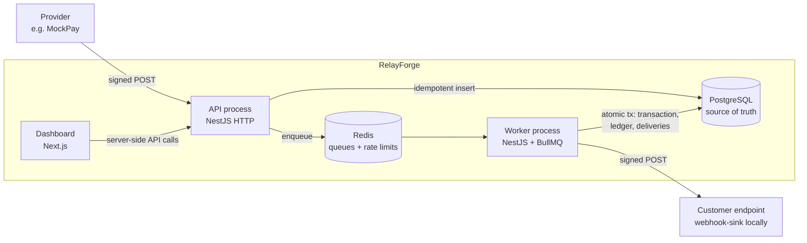
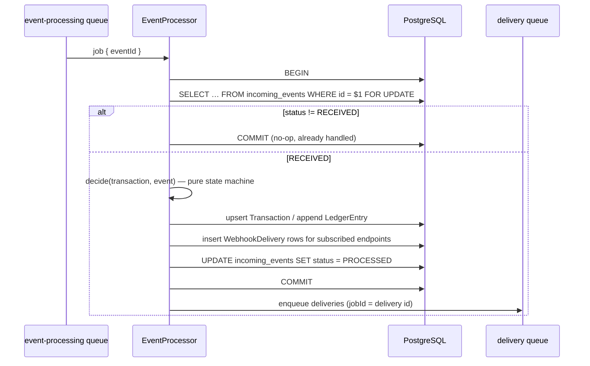
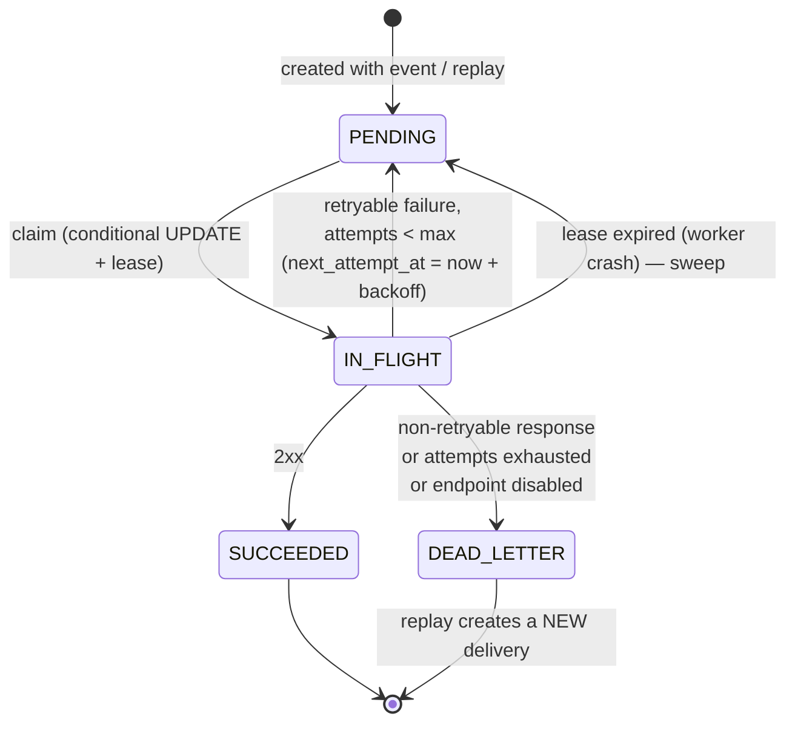

# RelayForge — Architecture & Implementation Plan

Status: **proposed** — the working plan the implementation follows. Once a
decision is built, its rationale moves into `docs/architecture.md`,
`docs/reliability.md`, `docs/security.md`, or an ADR under `docs/decisions/`.

---

## 1. System overview

RelayForge has four deployable units built from one monorepo:

| Unit            | Tech                  | Responsibility                                                                             |
| --------------- | --------------------- | ------------------------------------------------------------------------------------------ |
| `api` (http)    | NestJS                | Webhook ingestion, management API, health, Swagger                                          |
| `api` (worker)  | NestJS app context    | Event processing, webhook delivery, maintenance sweeps. Same image, different entrypoint    |
| `dashboard`     | Next.js               | Read-mostly operational UI; talks to the API server-side only                               |
| `webhook-sink`  | Node `http`           | Simulated customer endpoint with switchable failure modes                                   |
| `packages/shared` | TypeScript          | Webhook signature scheme, provider payload schemas, API response types                     |

The HTTP process and the worker process are the same NestJS codebase with two
entrypoints (`main.ts`, `worker.ts`). They scale independently and a slow
customer endpoint can never exhaust HTTP ingestion capacity.



### Core principle: PostgreSQL is the source of truth, Redis is a transport

Every piece of state that matters (event received, transaction applied,
delivery scheduled, attempt made) is committed to PostgreSQL **before** it is
acted on. BullMQ jobs carry only IDs. If Redis loses a job, or an enqueue
fails after a commit, a periodic maintenance sweep re-enqueues work from the
database. This makes the queue an optimisation for latency, not a durability
dependency, and removes the classic "committed to DB but never enqueued" gap
without introducing a separate outbox relay service.

---

## 2. Domain invariants

These are the rules the system must never violate. Each lists **where** it is
enforced. Where the database can enforce it, it does; application checks exist
for good error messages, not as the only line of defence.

### Ingestion

| #  | Invariant                                                                                      | Enforcement                                                                                       |
| -- | ---------------------------------------------------------------------------------------------- | ------------------------------------------------------------------------------------------------- |
| I1 | At most one `IncomingEvent` per `(providerId, externalEventId)`                                 | `UNIQUE(provider_id, external_event_id)` + `INSERT … ON CONFLICT DO NOTHING`                     |
| I2 | Only events with a valid signature are persisted                                                | Verification before insert; `CHECK (signature_valid)` (see decision D1)                          |
| I3 | Stored payload, hash, type, provider and external id are immutable                              | `BEFORE UPDATE` trigger rejecting changes to those columns; `BEFORE DELETE` trigger              |
| I4 | A duplicate delivery with a *different* payload for the same external id is rejected, never merged | `payload_hash` comparison → `409 EVENT_PAYLOAD_CONFLICT`                                          |
| I5 | Status/metadata consistency (`PROCESSED`/`IGNORED` ⇒ `processed_at`; `FAILED` ⇒ `failure_reason`) | `CHECK` constraints                                                                               |

### Financial state

| #  | Invariant                                                                                  | Enforcement                                                                                       |
| -- | ------------------------------------------------------------------------------------------ | ------------------------------------------------------------------------------------------------- |
| F1 | An event affects financial state at most once                                               | Row lock on the event + status check inside the tx; `UNIQUE(ledger_entries.source_event_id)`     |
| F2 | At most one `Transaction` per provider payment                                              | `UNIQUE(provider_id, external_payment_id)`                                                        |
| F3 | Transaction state, ledger entries, event status and resulting deliveries change atomically  | Single interactive DB transaction per event                                                       |
| F4 | Ledger entries are append-only                                                             | `BEFORE UPDATE OR DELETE` trigger raising an exception                                           |
| F5 | Amounts are positive integers in minor units; refunds never exceed the captured amount     | `BIGINT` + `CHECK (amount_minor > 0)`, `CHECK (refunded_amount_minor BETWEEN 0 AND amount_minor)` |
| F6 | The same provider refund is never applied twice, even under different event ids            | `UNIQUE(transaction_id, entry_type, external_reference_id)`                                       |
| F7 | Ledger net for a transaction equals `amount − refunded` (or 0 for failed payments)          | Enforced by the processor; **verified** by reconciliation (cross-row sums are not a cheap DB constraint) |

### Delivery

| #  | Invariant                                                                                  | Enforcement                                                                                       |
| -- | ------------------------------------------------------------------------------------------ | ------------------------------------------------------------------------------------------------- |
| D1 | One original delivery per `(event, endpoint)`                                               | Partial unique index `WHERE replay_of_delivery_id IS NULL`                                        |
| D2 | A delivery is attempted by at most one worker at a time                                     | Conditional `UPDATE … WHERE status = 'PENDING' AND next_attempt_at <= now()` claim with a lease   |
| D3 | Every completed attempt is recorded exactly once, and never modified                        | `UNIQUE(delivery_id, attempt_number)`; append-only trigger on `delivery_attempts`                 |
| D4 | Terminal states carry their evidence (`SUCCEEDED` ⇒ `delivered_at`, `DEAD_LETTER` ⇒ reason) | `CHECK` constraints                                                                               |
| D5 | Delivery history is never deleted; endpoints are soft-deleted                               | No delete paths; `ON DELETE RESTRICT` foreign keys                                                |
| D6 | Replay never mutates the original delivery and at most one replay of a delivery is active   | Replay inserts a new row with `replay_of_delivery_id`; partial unique index on active replays    |
| D7 | Delivery is **at-least-once**; receivers deduplicate by `webhook-id`                        | Documented contract; stable id header across retries                                              |

### Access & audit

| #  | Invariant                                                             | Enforcement                                                        |
| -- | --------------------------------------------------------------------- | ------------------------------------------------------------------ |
| A1 | Raw API keys are never stored or logged                                | Only SHA-256 hash stored (`UNIQUE`); pino redaction                |
| A2 | Revoked keys are rejected immediately                                  | Guard checks `revoked_at IS NULL` on every request (no key cache)  |
| A3 | Every tenant-owned read/write is scoped to the caller's workspace      | Workspace id comes from the authenticated key, never from input    |
| A4 | Signing secrets are encrypted at rest and never returned after creation | AES-256-GCM with `ENCRYPTION_KEY`; response DTOs omit them          |
| A5 | Security-relevant actions are audited in the same DB transaction       | `AuditLog` insert inside the action's tx; append-only trigger      |

---

## 3. Key flows

### 3.1 Ingestion — `POST /v1/providers/:provider/webhooks`

1. Express JSON parser with a size limit (`WEBHOOK_MAX_BODY_BYTES`, default 1 MiB) and raw body capture.
2. Resolve provider by slug → `404` if unknown.
3. Verify signature over the **raw bytes** (before any payload validation, so
   unauthenticated callers learn nothing about the schema) → `401`.
4. Enforce timestamp tolerance if the provider has one configured → `401`.
5. Validate the envelope and, for known event types, the typed `data` → `422`.
6. `INSERT … ON CONFLICT (provider_id, external_event_id) DO NOTHING RETURNING id`.
   - Inserted → enqueue `process-event` (jobId = event id) → `202`.
   - Not inserted → load existing row; same `payload_hash` → `202 { duplicate: true }`;
     different hash → `409`.
7. If enqueue fails after a successful insert, the request still returns `202`
   (the event is durable) and the failure is logged at `error`; the maintenance
   sweep picks the event up. This is an explicit recovery path, not a swallowed error.

Same request ⇒ same status code: duplicates return `202` so the provider sees an
idempotent response.

### 3.2 Event processing (worker)



- The row lock serialises concurrent workers on the same event; the second one
  observes `PROCESSED` and exits. No lease/heartbeat is needed because a crash
  rolls the whole transaction back and the event stays `RECEIVED`.
- No network I/O happens while the transaction is open.
- The state machine is a pure function (unit-tested exhaustively):

| Event               | No transaction          | SUCCEEDED / PARTIALLY_REFUNDED           | FAILED                    | REFUNDED       |
| ------------------- | ----------------------- | ---------------------------------------- | ------------------------- | -------------- |
| `payment.succeeded` | create SUCCEEDED + PAYMENT entry | reject (`INVALID_TRANSITION`)    | → SUCCEEDED + PAYMENT entry | reject        |
| `payment.failed`    | create FAILED, no entry | reject                                   | no-op (already failed)    | reject         |
| `payment.refunded`  | **retryable** (`TRANSACTION_NOT_FOUND`, may arrive out of order) | REFUND entry, update refunded amount/status; reject if exceeding or currency differs | reject | reject |
| unknown type        | event → `IGNORED`       | —                                        | —                         | —              |

- Retryable outcomes throw so BullMQ retries with backoff; after the final
  attempt the event is marked `FAILED` with its reason. Non-retryable rejections
  mark the event `FAILED` immediately and never touch financial state.
- Deliveries are created only for `PROCESSED` events.

### 3.3 Delivery (worker)



1. Claim: `UPDATE webhook_deliveries SET status='IN_FLIGHT', lease_expires_at=… WHERE id=$1 AND status='PENDING' AND next_attempt_at <= now() RETURNING …`. Zero rows ⇒ another worker has it or it is not due ⇒ no-op.
2. Sign with the endpoint secret, POST with a hard timeout, no redirect following.
3. In one DB transaction: insert `DeliveryAttempt` + transition the delivery.
4. On retry: enqueue a delayed job for `next_attempt_at`.

**Retry classification**

| Outcome                                                        | Class                    |
| -------------------------------------------------------------- | ------------------------ |
| 2xx                                                            | success                  |
| timeout, DNS/connection/reset errors, 408, 429, 500, 502, 503, 504 | retryable            |
| other 4xx, other 5xx, 3xx (redirects are not followed), blocked destination | permanent → `DEAD_LETTER` |

**Backoff**: `cap = min(maxDelay, base · 2^(attempt−1))`, `delay = cap/2 + random(0, cap/2)`
("equal jitter": spreads retries while guaranteeing growth). `Retry-After` on
429/503 is honoured, bounded by `maxDelay`. `maxAttempts` is snapshotted on the
delivery at creation so config changes do not alter in-flight semantics. The
clock and random source are injected so tests are deterministic.

**Replay** — `POST /v1/deliveries/:id/replay`: allowed from `SUCCEEDED` or
`DEAD_LETTER`, requires an active endpoint. Inserts a new `PENDING` delivery with
the original event's payload and `replay_of_delivery_id`, writes an audit log
row in the same transaction, then enqueues. Original row and its attempts are
untouched.

### 3.4 Maintenance sweep

A BullMQ job scheduler (single execution per interval across all workers)
runs every 30 s:

- re-enqueue `RECEIVED` events older than a grace period;
- re-enqueue due `PENDING` deliveries older than a grace period;
- return `IN_FLIGHT` deliveries with an expired lease to `PENDING`.

All re-enqueues use deterministic job ids, and every consumer re-checks state
in the database, so double-enqueue is harmless.

---

## 4. Database schema (design)

Prisma schema below is the design target; Phase 1 turns it into a validated
schema plus a hand-edited migration for what Prisma cannot express (CHECK
constraints, partial unique indexes, append-only triggers).

- IDs: UUIDv7 (time-ordered ⇒ stable cursor pagination on `id`).
- Money: `BIGINT` minor units + ISO-4217 `CHAR(3)`. Serialised as strings in JSON to avoid precision loss.
- Foreign keys: `ON DELETE RESTRICT` everywhere. No cascades over financial or audit data.
- Tenant integrity: child rows carry `workspace_id` and reference their parent by
  a composite `(id, workspace_id)` key where cross-tenant mixing would be a
  real bug (event→provider, ledger→transaction, delivery→event, delivery→endpoint).

```prisma
enum ApiKeyRole          { ADMIN MEMBER }
enum IncomingEventStatus { RECEIVED PROCESSED IGNORED FAILED }
enum TransactionStatus   { SUCCEEDED FAILED PARTIALLY_REFUNDED REFUNDED }
enum LedgerEntryType     { PAYMENT REFUND }
enum DeliveryStatus      { PENDING IN_FLIGHT SUCCEEDED DEAD_LETTER }
enum DeadLetterReason    { MAX_ATTEMPTS_EXHAUSTED NON_RETRYABLE_RESPONSE ENDPOINT_UNAVAILABLE }
enum AttemptOutcome      { SUCCESS RETRYABLE_FAILURE PERMANENT_FAILURE }
enum AuditActorType      { API_KEY SYSTEM }

model Workspace {
  id        String   @id @default(uuid(7)) @db.Uuid
  name      String
  createdAt DateTime @default(now())
}

model ApiKey {
  id          String     @id @default(uuid(7)) @db.Uuid
  workspaceId String     @db.Uuid
  name        String
  role        ApiKeyRole
  prefix      String     @unique            // "rf_3kq9x2ab" — shown in UI/logs
  keyHash     String     @unique @db.Char(64) // sha256(full key), hex
  lastUsedAt  DateTime?
  revokedAt   DateTime?
  createdAt   DateTime   @default(now())
}

model Provider {
  id                      String   @id @default(uuid(7)) @db.Uuid
  workspaceId             String   @db.Uuid
  slug                    String   @unique   // path segment in the ingestion URL
  name                    String
  signingSecretCiphertext String               // AES-256-GCM
  timestampToleranceSec   Int?                 // null = tolerance check disabled
  createdAt               DateTime @default(now())
  @@unique([id, workspaceId])
}

model IncomingEvent {
  id                 String              @id @default(uuid(7)) @db.Uuid
  workspaceId        String              @db.Uuid
  providerId         String              @db.Uuid
  externalEventId    String
  eventType          String
  payload            Json
  payloadHash        String              @db.Char(64)
  signatureValid     Boolean
  status             IncomingEventStatus @default(RECEIVED)
  processingAttempts Int                 @default(0)
  failureReason      String?
  receivedAt         DateTime            @default(now())
  processedAt        DateTime?
  @@unique([providerId, externalEventId])
  @@unique([id, workspaceId])
  @@index([workspaceId, id(sort: Desc)])
  @@index([status, receivedAt])
}

model Transaction {
  id                  String            @id @default(uuid(7)) @db.Uuid
  workspaceId         String            @db.Uuid
  providerId          String            @db.Uuid
  externalPaymentId   String
  status              TransactionStatus
  currency            String            @db.Char(3)
  amountMinor         BigInt
  refundedAmountMinor BigInt            @default(0)
  createdByEventId    String            @unique @db.Uuid
  createdAt           DateTime          @default(now())
  updatedAt           DateTime          @updatedAt
  @@unique([providerId, externalPaymentId])
  @@unique([id, workspaceId])
}

model LedgerEntry {
  id                  String          @id @default(uuid(7)) @db.Uuid
  workspaceId         String          @db.Uuid
  transactionId       String          @db.Uuid
  sourceEventId       String          @unique @db.Uuid
  entryType           LedgerEntryType
  externalReferenceId String          // payment id or refund id
  amountMinor         BigInt
  currency            String          @db.Char(3)
  createdAt           DateTime        @default(now())
  @@unique([transactionId, entryType, externalReferenceId])
}

model WebhookEndpoint {
  id                      String    @id @default(uuid(7)) @db.Uuid
  workspaceId             String    @db.Uuid
  url                     String
  description             String?
  eventTypes              String[]
  signingSecretCiphertext String
  isActive                Boolean   @default(true)
  createdAt               DateTime  @default(now())
  updatedAt               DateTime  @updatedAt
  deletedAt               DateTime?
  @@unique([id, workspaceId])
}

model WebhookDelivery {
  id                 String            @id @default(uuid(7)) @db.Uuid
  workspaceId        String            @db.Uuid
  eventId            String            @db.Uuid
  endpointId         String            @db.Uuid
  replayOfDeliveryId String?           @db.Uuid
  payload            Json
  status             DeliveryStatus    @default(PENDING)
  attemptCount       Int               @default(0)
  maxAttempts        Int
  nextAttemptAt      DateTime?
  leaseExpiresAt     DateTime?
  deliveredAt        DateTime?
  deadLetteredAt     DateTime?
  deadLetterReason   DeadLetterReason?
  createdAt          DateTime          @default(now())
  updatedAt          DateTime          @updatedAt
  @@index([workspaceId, status, id(sort: Desc)])
  @@index([status, nextAttemptAt])
}

model DeliveryAttempt {
  id             String         @id @default(uuid(7)) @db.Uuid
  deliveryId     String         @db.Uuid
  attemptNumber  Int
  outcome        AttemptOutcome
  responseStatus Int?
  errorCode      String?        // TIMEOUT | NETWORK_ERROR | BLOCKED_DESTINATION | …
  errorMessage   String?
  responseBody   String?        // truncated to 2 KiB
  durationMs     Int
  startedAt      DateTime
  createdAt      DateTime       @default(now())
  @@unique([deliveryId, attemptNumber])
}

model AuditLog {
  id           String         @id @default(uuid(7)) @db.Uuid
  workspaceId  String         @db.Uuid
  actorType    AuditActorType
  actorId      String?
  action       String         // "api_key.revoked", "delivery.replayed", …
  resourceType String
  resourceId   String
  metadata     Json
  requestId    String?
  createdAt    DateTime       @default(now())
  @@index([workspaceId, id(sort: Desc)])
}
```

(Relations omitted above for readability; they are part of the real schema.)

---

## 5. Cross-cutting design

- **Module layout** (`apps/api/src`): `config`, `database`, `logging`, `auth`
  (API keys + guard), `rate-limit`, `audit`, `crypto` (secret cipher),
  `providers`, `ingestion`, `events`, `processing`, `transactions` (incl. ledger
  read), `endpoints`, `deliveries`, `reconciliation`, `metrics`, `health`,
  `queue`, `maintenance`. Dependencies point inward; no circular imports.
- **Prisma directly in services** — no repository layer. Queries that need
  `FOR UPDATE`, `ON CONFLICT` or aggregates use typed `$queryRaw`.
- **Validation**: `class-validator` DTOs for the management API (native Nest +
  Swagger integration). `zod` for provider payload schemas in `packages/shared`,
  because they describe an external contract shared by the ingestion pipeline
  and the MockPay demo producer, and need discriminated unions. `zod` also
  validates environment config at boot (fail fast).
- **Errors**: domain errors are typed classes with stable `code`s; one global
  filter renders `{ error: { code, message, details?, requestId } }`. Unknown
  errors are logged with stack and rendered as `500 INTERNAL_ERROR` without internals.
- **Logging**: `nestjs-pino`, JSON, request id from `X-Request-Id` or generated.
  Redaction of `authorization`, `webhook-signature`, and any `*secret*`/`*apiKey*`
  path. Worker logs use child loggers carrying `eventId`, `deliveryId`,
  `attemptNumber`, `correlationId` (= incoming event id), `durationMs`.
- **Rate limiting**: `@nestjs/throttler` with a Redis-backed storage so limits hold
  across API replicas. Keyed per API key for management routes and per
  provider+IP for ingestion. Fixed window — simple, with a documented tradeoff.
- **SSRF protection** for customer endpoints: `https` required unless
  `ALLOW_INSECURE_ENDPOINTS`; resolved addresses checked at connect time (defeats
  DNS rebinding) against private/loopback/link-local ranges unless
  `ALLOW_PRIVATE_ENDPOINTS` (enabled in local compose for the sink).
- **Signature scheme**: [Standard Webhooks](https://www.standardwebhooks.com/)
  compatible HMAC-SHA256 (`webhook-id`, `webhook-timestamp`, `webhook-signature`)
  for both inbound (MockPay) and outbound deliveries — an existing open spec
  instead of an invented one, so customers can verify with off-the-shelf libraries.
  Multiple signatures in the header are accepted to allow secret rotation.
- **Pagination**: cursor-based on UUIDv7 id, `limit` capped at 100.
- **Dashboard**: server components fetch the API with a server-only API key;
  the key never reaches the browser. It has no user login and is documented as
  an internal tool that must not be exposed publicly.

---

## 6. Decisions that deviate from, or interpret, the brief

- **D1 — `signatureValid` is always `true` for stored events.** Persisting
  unverified requests would let anyone *squat* an `(provider, externalEventId)`
  pair with a forged payload and block the genuine event via the unique
  constraint, and would turn the table into unauthenticated storage. Rejected
  requests are logged (without payload) and rejected with 401. The column is
  kept, and constrained by `CHECK`, so the invariant is visible in the schema.
- **D2 — Provider slug is globally unique.** The ingestion route has no
  workspace segment, so the slug is the routing key (e.g. `mockpay-demo`).
- **D3 — Single-entry ledger.** One immutable, positive-amount entry per
  financial event (`PAYMENT` / `REFUND`), which matches "one transaction creates
  one ledger entry". A full double-entry system is listed as future work.
- **D4 — Permanent 4xx failures dead-letter immediately** (reason
  `NON_RETRYABLE_RESPONSE`) so operators have one queue of failed deliveries to
  inspect and replay.
- **D5 — Delivery is at-least-once.** A crash between the HTTP response and the
  attempt commit re-sends the request. Exactly-once delivery over HTTP is not
  achievable; the stable `webhook-id` lets receivers deduplicate.
- **D6 — Dashboard metrics come from a `GET /v1/metrics/overview` endpoint**
  (not in the brief's list) computed with SQL aggregates over real rows.
  "Average delivery latency" is defined as mean attempt duration over the window.
- **D7 — Unknown event types are stored and marked `IGNORED`** rather than
  rejected, so providers adding new types do not trigger retry storms.

---

## 7. Implementation phases

Each phase ends with: lint, format check, typecheck, unit + integration tests
green, an architecture review of the diff, and one or more logical commits.

| Phase | Scope | Exit criteria |
| ----- | ----- | ------------- |
| **0. Foundation** | npm workspaces, strict TS base config, ESLint (type-checked) + Prettier, `packages/shared` skeleton, dev `docker-compose` (Postgres 16, Redis 7), `.env.example`, MIT license, CI skeleton | All quality commands pass on an empty-but-real skeleton |
| **1. Data layer & platform** | Prisma schema + migrations (CHECKs, partial indexes, triggers), config validation, Prisma module, pino logging, error filter, health endpoints, seed, integration test harness | Migration applies; tests prove triggers/constraints reject bad writes; `/health/ready` checks DB + Redis |
| **2. Access control** | Secret cipher, API key issue/list/revoke, guard, roles, audit log service, Redis rate limiting, Swagger | Tests 14, 15; ADR 005 |
| **3. Ingestion** | Signature scheme in `shared` (unit-tested), MockPay payload schemas, webhook controller with raw body + size limit, idempotent insert, enqueue, events read API | Tests 1, 2, 3, 4; 20-way concurrent ingest yields one event; ADR 001 |
| **4. Processing** | BullMQ module, worker entrypoint, transaction state machine, locked processor, ledger, delivery creation, endpoints CRUD, transactions/ledger read API | Tests 5, 6, 7; ADR 002, ADR 003 |
| **5. Delivery** | Outbound signing, HTTP client with timeout + SSRF guard, retry classification, backoff, attempts, dead-letter, maintenance sweep, deliveries API, replay + audit | Tests 8–13; ADR 004 |
| **6. Reconciliation & metrics** | Reconciliation SQL checks + structured report, admin endpoint, metrics endpoint | Test 16 |
| **7. Local platform** | webhook-sink, MockPay `demo:event` / `demo:duplicate`, Dockerfiles, full compose with migrate+seed one-shot | Clean clone → `docker compose up --build` → demo scripts show processing, retries, dead-letter |
| **8. Dashboard** | Overview, Events, Deliveries (+ replay), Dead Letter, Endpoints, Transactions/Ledger | Builds, lint/typecheck clean, verified against running stack |
| **9. Hardening & docs** | Full CI (lint, format, typecheck, unit, integration with service containers, build), README, `architecture.md`, `reliability.md`, `security.md`, final review | Every quality gate green in CI |

---

## 8. Test strategy

- **Unit** (no I/O): signature sign/verify, timestamp tolerance, backoff and
  jitter bounds, outcome classification, transaction state machine, API key
  generation/hashing, secret cipher, reconciliation report shaping.
- **Integration** (real PostgreSQL + Redis, `runInBand`): the Nest app is built
  from the real `AppModule`; requests go through Supertest. Worker logic is
  invoked through the same services the BullMQ processors call, with an injected
  clock and random source; delivery tests run against an in-test HTTP server that
  returns 500/400/hangs. No mocks of Prisma, Postgres, or the HTTP client.
- **Rollback test** installs a temporary Postgres trigger that raises on
  `webhook_deliveries` insert, then asserts that no transaction or ledger row
  exists and the event is still `RECEIVED` — a genuine database failure mid-transaction,
  not a mocked one.
- **Concurrency test** fires ≥ 20 identical signed requests with `Promise.all`,
  then runs the processor concurrently for the resulting job(s), and asserts
  exactly one event, one transaction, one ledger entry.
- Tables are truncated between integration tests; tests never depend on order.

---

## 9. Toolchain versions

Registry state at planning time (2026-09-14) reported `typescript@7.0.2`,
`prisma@8.0.0-rc.15`, `@nestjs/core@12`, `bullmq@6`, `next@16`, `jest@30`,
`zod@4`, `tailwindcss@4`. Phase 0 pins exact versions using these rules:

- **Stable releases only.** No release candidates (Prisma → latest stable major, not the 8.x RC).
- **Compatibility over recency.** TypeScript is pinned to the newest version
  supported by `typescript-eslint`, `ts-jest`, the Nest CLI and Next.js. If the
  TS 7 native compiler is not yet supported across that toolchain, the project
  uses the latest 5.x/6.x and records why.
- Node 22 LTS in Docker and CI (`engines.node >= 22`); lockfile committed.

---

## 10. Explicit non-goals

- No claims about throughput; no benchmark numbers are published without a
  reproducible benchmark in the repo.
- No distributed tracing, no Kubernetes manifests, no multi-region story.
- No user accounts/SSO for the dashboard.
