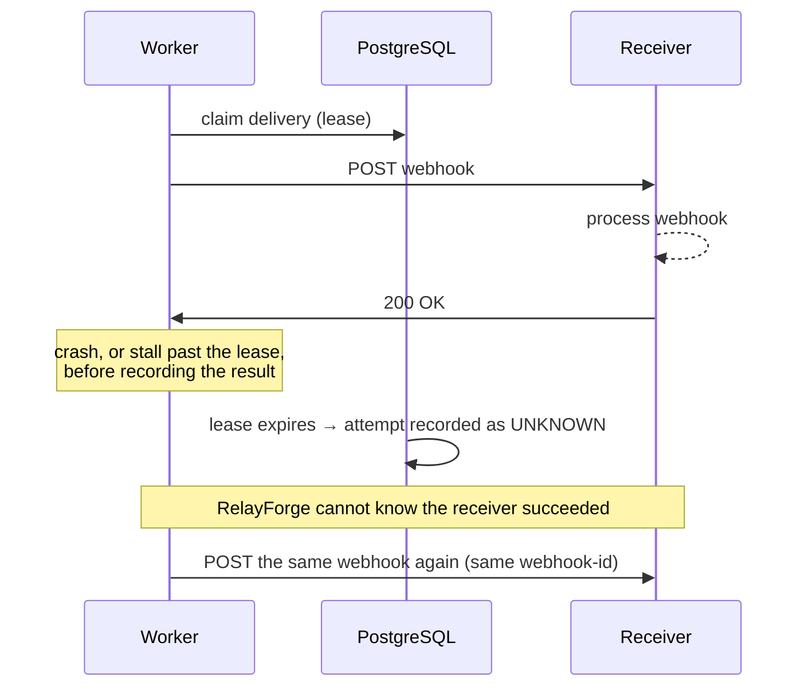

# Reliability

This document describes what RelayForge guarantees, how each guarantee is
enforced, and — just as important — what it does **not** guarantee. Unless noted
otherwise, each guarantee is covered by integration tests that run against real
PostgreSQL and Redis.

## Roles of the moving parts

| Component      | Role                     | If it fails                                                                                   |
| -------------- | ------------------------ | --------------------------------------------------------------------------------------------- |
| PostgreSQL     | Source of truth          | Nothing is accepted or processed; nothing is lost                                             |
| Outbox table   | Durable handoff boundary | —                                                                                             |
| Redis / BullMQ | Execution transport      | Ingestion keeps accepting webhooks; publishing retries with backoff; work resumes on recovery |
| Recovery sweep | Defence in depth         | Delays repair of stranded work; never affects correctness                                     |
| Worker process | Executes jobs            | Leases expire, recovery reschedules work; nothing is lost                                     |

## Guarantees

### 1. A webhook is accepted at most once

The same `(provider connection, external event id)` produces exactly one
`IncomingEvent`, regardless of how many copies arrive or how concurrently.

- **Enforcement:** `UNIQUE (provider_connection_id, external_event_id)` and
  `INSERT … ON CONFLICT DO NOTHING`. There is no check-then-insert window.
- **Proof:** 25 identical signed requests sent concurrently yield one event, one
  outbox message and exactly one `duplicate: false` response.
- See [ADR 001](decisions/001-idempotency.md).

### 2. Accepted work cannot be lost between the database and the queue

- **Enforcement:** the event and its `EVENT_PROCESSING_REQUESTED` outbox message
  are written in one transaction. A publisher moves committed outbox rows into
  BullMQ and marks them published only after Redis acknowledges. Redis is never
  called inside a business transaction.
- **Proof:** an injected failure on the outbox insert leaves no event behind.
  A publisher pointed at an unreachable Redis leaves the message unpublished and
  reschedules it with backoff; once Redis is reachable it is published. Jobs use
  the outbox message id as their BullMQ job id, so a publish that is retried
  after Redis already accepted the job does not create a second job.
- See [ADR 006](decisions/006-transactional-outbox.md).

### 3. An event changes financial state at most once, atomically

- **Enforcement:** one database transaction per event: row lock on the event,
  per-payment advisory lock, pure state machine, domain transaction, balanced
  journal, deliveries and their outbox messages, final event status. Unique keys
  back up every step (one journal per source event, one transaction per provider
  payment, one refund journal per refund id).
- **Proof:** 25 concurrent duplicate webhooks followed by 10 concurrent processing
  runs of the stored event yield one transaction, one journal and two postings.
  A database failure injected after the ledger writes leaves no transaction,
  journal, posting, ledger account, delivery or delivery outbox message; the event
  remains `RECEIVED` and processes normally on the next run.
- See [ADR 002](decisions/002-event-processing.md).

### 4. The ledger always balances

- **Enforcement:** postings are validated before writing, and deferred constraint
  triggers reject unbalanced or single-posting journals at `COMMIT`. Postings can
  only be added in the transaction that created their journal. Journals and
  postings are append-only. Currency consistency is enforced by composite foreign keys.
- **Proof:** raw SQL attempts to commit an unbalanced journal, a single-posting
  journal, or a balanced pair appended to an existing journal all fail.
- See [ADR 003](decisions/003-ledger.md).

### 5. At most one worker attempts a delivery at a time

- **Enforcement:** a conditional `UPDATE` claims a due delivery and records a
  lease owner and expiry; the database requires `PROCESSING` ⇔ lease set.
  Finalising an attempt succeeds only while the same worker still holds the lease.
- **Proof:** two workers racing to claim send one request. A worker that stalls
  past its lease, after another worker has re-claimed the delivery, cannot
  overwrite the newer attempt (verified by removing the lease-owner condition and
  watching the test fail). If the same process were to re-claim its own delivery,
  the unique `(delivery_id, attempt_number)` key still rejects a second record for
  the same attempt.

### 6. Delivery history is never rewritten

- Database triggers reject deleting deliveries and changing a delivery once it
  is `SUCCEEDED` or `DEAD_LETTER`; its retry budget and payload never change.
- Attempt rows are append-only. Endpoints cannot be deleted, only soft-deleted.
- Replay creates a **new** delivery referencing the original.

### 7. Work stranded after the handoff is repaired

The recovery sweep (one replica at a time, via an advisory lock):

- reclaims deliveries whose lease expired, recording the attempt as `UNKNOWN`
  (`LEASE_EXPIRED`) and scheduling a retry, or dead-lettering the delivery if that
  was its last attempt;
- re-requests `RECEIVED` events and `PENDING` deliveries that have been waiting
  longer than `RECOVERY_STALE_AFTER_MS` with no unpublished or recently published
  outbox message (for example, because Redis lost a published job);
- prunes outbox messages published longer ago than `OUTBOX_RETENTION_MS`.

If another replica holds the sweep lock, the sweep is skipped rather than queued.
Consumers re-check database state, so a job that runs twice is a no-op.

## Delivery semantics: at-least-once

RelayForge delivers webhooks **at least once**. It does not, and cannot, deliver
exactly once over HTTP.

### The unavoidable ambiguous case

Once a request has been sent, no protocol step can make "the receiver processed
it" and "RelayForge recorded that" a single atomic fact. RelayForge therefore
chooses to **retry** rather than risk losing a webhook.

This behaviour is reproduced by an integration test: the receiver holds its `200`
response while the worker's lease expires and recovery records an `UNKNOWN`
attempt; the stale worker then gets the `200` but can no longer record it, and the
next attempt delivers the same `webhook-id` again.

### What receivers must do

Every request for an event carries the same `webhook-id` header (the RelayForge
event id, not the provider's event id) on every retry **and every replay**. Receivers must deduplicate on it,
for example with a unique constraint on processed webhook ids.

The local webhook sink demonstrates this: it flags repeated `webhook-id` values as
duplicates in `GET /received` (in memory, remembering the last 10,000 ids).

### What the attempt history means

- Each attempt number has **at most one** immutable record: the outcome the
  worker observed, or `UNKNOWN`.
- `UNKNOWN` means the worker lost its lease before recording a result. The
  receiver **may or may not** have received that request.
- The history does **not** claim that every physical HTTP request was recorded
  with its result.

## Retries and dead letters

| Result                                                       | Handling                                  |
| ------------------------------------------------------------ | ----------------------------------------- |
| 2xx                                                          | `SUCCEEDED`                               |
| Timeout, network error, or a status in the retryable list    | Retry with exponential backoff and jitter |
| Any other status, or a destination blocked by the SSRF guard | `DEAD_LETTER` (`NON_RETRYABLE_RESPONSE`)  |
| Endpoint disabled or deleted before the attempt              | `DEAD_LETTER` (`ENDPOINT_UNAVAILABLE`)    |
| Retryable failure or `UNKNOWN` attempt on the last attempt   | `DEAD_LETTER` (`MAX_ATTEMPTS_EXHAUSTED`)  |

The retryable list is `DELIVERY_RETRYABLE_STATUS_CODES` (default `408,429,5xx`).
On a retryable 429 or 503, `Retry-After` can lengthen the delay but never shorten
it; the result is still capped at `DELIVERY_RETRY_MAX_MS`. Each delivery stores its
retry budget when it is created (a replay takes the budget configured at replay
time). Dead-lettered deliveries remain queryable with their full attempt history
and can be replayed. See [ADR 004](decisions/004-retry-policy.md).

## Event processing retries

- A refund that arrives before its payment is retried later with backoff, via a
  future-dated outbox message, up to `EVENT_PROCESSING_MAX_ATTEMPTS`; then the
  event is marked `FAILED` (`TRANSACTION_NOT_FOUND`).
- Business rule violations (for example a refund exceeding the captured amount)
  mark the event `FAILED` immediately and never touch financial state.
- If processing keeps throwing unexpectedly until BullMQ exhausts the job's
  attempts, the consumer marks the event `FAILED` with `PROCESSING_ERROR`, so a
  poison event cannot loop through recovery forever. (The test exercises this
  handler directly rather than exhausting a real BullMQ job.)

## Reconciliation

The database prevents unbalanced or edited journals, but some consistency rules
span rows and tables, and data can be changed outside the application.
`POST /v1/admin/reconciliation/run` compares domain transactions with the ledger
in one `REPEATABLE READ, READ ONLY` transaction and reports missing or duplicate
ledger entries, amount and currency mismatches, unexpected reversals, orphan
entries, unbalanced journals, and `merchant_balance` / `provider_clearing` balances
that disagree with the transactions. Reports list at most 500 discrepancies and say
when they are truncated.

## Known limits

- **Clock skew.** Leases and schedules use each process's clock. Replicas are
  assumed to run NTP-synchronised clocks; skew larger than the lease margin could
  cause premature lease reclamation (which is safe, but produces an extra attempt).
- **Publish latency** is bounded by the outbox poll interval (500 ms by default).
- **Throughput** has not been benchmarked. No performance figures are claimed.
- **Retention** of rejected attempts, audit logs and delivery history is not
  implemented. Those tables are protected against deletion by triggers, so a
  retention job would need a deliberate migration; until then they grow.
